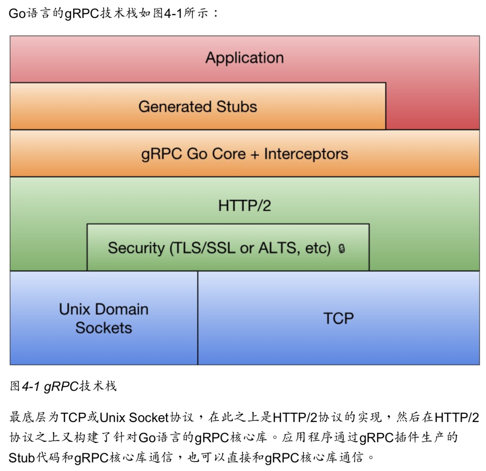

## 1.5.3 顺序一致性内存模型

go 中同一个 goroutine 保证顺序一致性内存模型，但是不同 goroutine 之间不保证，需要定义明确的同步事件。

```go
package main

import (
	"fmt"
	"sync"
)

func main() {
	go fmt.Println("hello")
}

// 使用 done 同步
func main() {
	done := make(chan int, 1)

	go func() {
		fmt.Println("hello")
		done <- 1 // 同一个 goroutine 满足顺序一致性，这个时候已经打印
	}()

	<-done
}

// 或者用mutex同步
func main() {
	var mu sync.Mutex
	mu.Lock()
	go func() {
		fmt.Println("hello")
		mu.Unlock() // UhLck一定在 print 之后发生
	}()
	mu.Lock() // Lock一定在unlock之后发生，通过sync.Mutex保证
}
```

## 1.5.4 初始化顺序


## 1.5.6 基于Channel通信

```go
// 利用channel缓存大小控制并发执行的goroutine最大数
var limit = make(chan int, 3)

func main() {
	for _, w := range work {
		go func() {
			limit <- 1
			w()
			<-limit
		}()
	}
	select {} // 阻塞 main，避免过早退出
}
```

# 1.6 常见并发模式

CSP: 同步通信

> Do not communicate by sharing memory; instead, share memory by communicating.
> 不要通过共享内存来通信，而应通过通信共享内存。

## 1.6.1 并发Hello World

并发编程核心概念是同步通信。

```go
// 错误的示例
package main

import (
	"fmt"
	"sync"
)

func main() {
	var mu sync.Mutex
	mu.Lock()
	go func() {
		fmt.Println("hello")
		mu.Lock()
	}()
	mu.Unlock()  //这里的Lock/Unlock无法保证顺序，必须先Lock之后才能Unlock
}
```

修复方式用main 中使用两次 lock

```go
func main() {
	var mu sync.Mutex
	mu.Lock()
	go func() {
		fmt.Println("hello")
		mu.Unlock() // UhLck一定在 print 之后发生
	}()
	mu.Lock() // Lock一定在unlock之后发生，通过sync.Mutex保证
}
```

使用无缓冲管道实现同步:

```go
func main() {
	done := make(chan int)

	go func() {
		fmt.Println("hello")
		<- done
	}()
	done <- 1   // 发送操作完成才有可能接受，所以会等待先执行 <-done

}
```

对于无缓存Channel 进行的接收，发生在对该 channel 进行发送完成之前。

更好的做法是将管道的发送和接受方调换，使用有缓存的管道。避免同步受到管道缓存大小影响。
对于带缓冲的channel,对于channel 的第 k 个接手完成操作发生在第k+c 个发送操作完成之前，
其中 c 是 channel 的缓存大小。


```go
func main() {
	done := make(chan int, 1)

	go func() {
		fmt.Println("hello")
		done <- 1
	}()
	<-done
}
```

扩展到 n 个：

```go
package main

import (
	"fmt"
)

func main() {
	done := make(chan int, 10)

	for i := 0; i < cap(done); i++ {
		go func() {
			fmt.Println("hello")
			done <- 1
		}()
	}

	for i := 0; i < cap(done); i++ {
		<-done
	}

}
```
当然最简单的方式使用 sync.WaitGroup , wg.Add wg.Done wg.Wait


### 1.6.2 生产者消费者

```go
package main

import (
	"fmt"
	"os"
	"os/signal"
	"syscall"
)

func Producer(factor int, out chan<- int) {
	for i := 0; ; i++ {
		out <- i * factor
	}
}

func Consumer(in <-chan int) {
	for v := range in {
		fmt.Print(v)
	}
}

func main() {
	ch := make(chan int, 64)
	go Producer(3, ch)
	go Producer(5, ch)
	go Consumer(ch)

	sig := make(chan os.Signal, 1)
	signal.Notify(sig, syscall.SIGINT, syscall.SIGTERM)
	fmt.Printf("quit %v\n", <-sig)
}
```

### 1.6.3 发布订阅

Pub/Sub m:n

### 1.6.4 控制并发数

通过带缓存管道的发送和接收规则实现最大并发阻塞。

```go
package main

var limit = make(chan int, 3)

func main() {
	for _, w := range work {
		go func() {
			limit <- 1
			w()
			<-limit
		}()
	}
	select {}
}

type gate chan bool 
func (g gate) enter() { g<-true }
func (g gate) leave() { <-g }

type gatefs struct {
	fs vfs.FileSystem
	gate
}

func (fs gatefs) Lstat(p string) (os.FileInfo, error) {
	fs.enter()
	defer fs.leave()
	return fs.fs.Lstat(p)
}
```

### 1.6.5 赢者为王

```go
func main() {
	ch := make(chan string, 32)

	go func() {
		ch <- searchByBing("golang')"
	}()

	go func() {
		ch <- searchByGoogle("golang')"
	}()

	go func() {
		ch <- searchByBaidu("golang')"
	}()

	fmt.Println(<-ch)
}
```

### 1.6.7 并发安全退出

```go
package main

import (
	"fmt"
	"sync"
	"time"
)

func worker(wg *sync.WaitGroup, cannel chan bool) {
	defer wg.Done()

	for {
		select {
		default:
			fmt.Println("hello")
		case <-cannel:
			return
		}
	}
}

func main() {
	cancel := make(chan bool)

	var wg sync.WaitGroup
	for i := 0; i < 10; i++ {
		wg.Add(1)
		go worker(&wg, cancel)
	}
	time.Sleep(time.Second)
	close(cancel)
	wg.Wait()
}
```


### 1.6.8 context 包

go1.7 增加了 context, 简化对于处理单个请求的多个goroutine之间与请求域的数据、超时和退出等操作。


# 1.7 错误和异常

错误被认为可预期的，异常则是非预期的。

### 1.7.1 错误处理策略

go 中的导出函数一般不抛出异常，一个未受控的异常可以看成程序 bug。
web框架一般会防御性地捕获所有异常。

```go
// go库实现习惯是即使包内部使用了 panic，但是在函数 export 时候会被转换成明确的错误值
func ParseJSON(input string) (s *Syntax, err error) {
	defer func() {
		if p:=recover(); p!=nil {
			err = fmt.Errorf("JSON: internal error: %v", p)
		}
	}()
	// ... parser ...
}
```

### 1.7.2 获取错误上下文


一般为了防止丢失错误信息，一般使用包装函数。
go 大部分代码逻辑类似，先一系列初始检查，用于防止错误发生，然后是实际逻辑。

```go
f, err := op.Open("filename")
if err !=nil {
	// 失败场景
}
// 正常流程
```


`1.7.3 错误的错误返回

go 中 error 是一种接口类型。接口信息包含了原始类型和原始的值。
只有当接口的类型和原始值都为空，接口值才对应 nil。`

```go
// 错误示例
func returnsError() error {
	var p *MyError = nil
	if bad() {
		 p = ErrBad
	}
	return p // weill always return a non-nil error
	// 返回的是一个Myerror类型的空指针，而不是 nil
}

// rightway
func returnsError() error {
	if bad() {
		return (*MyError)(err)
	}
	return nil
}

```

### 1.7.4 剖析异常

必须在 defer 函数中直接调用 recover，并且不能包装 recover 函数，直接调用。
必须和有异常的栈帧只隔一个栈帧才能正确捕获异常。


--- 2章 CGO 编程


--- 4章 RPC和Protobuf

RPC (Remote Procedure Call)

# 4.1 RPC 入门

示例使用了内置的rpc 模块演示

# 4.2 Protobuf

Prtocol Buffers简称

# 4.3 玩转 RPC

# 4.4 gRPC 入门

基于 HTTP/2 协议设计，可以基于一个HTTP/2链接提供多个服务。




