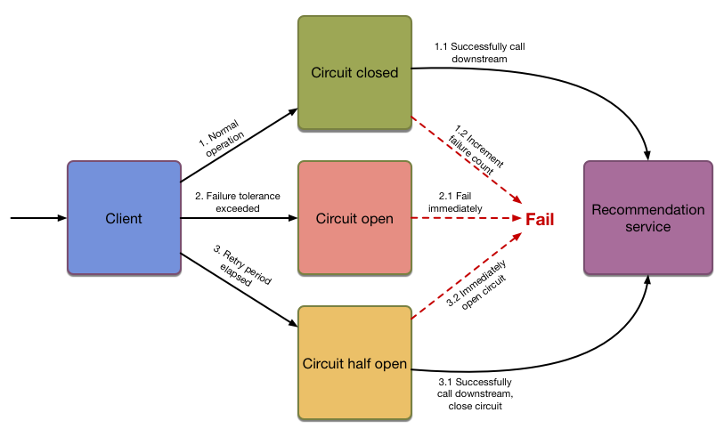

code: https://github.com/building-microservices-with-go/

 # 3. Docker

 Containers are immutable instances of images, and the data volumes are by default non-persistent.

# 4. Testing

use httptest

```
func TestSearchHandler( t *testing.T) {
	handler := SearchHandler{}
	request := httptest.NewRequest("GET", "/search", nil)
	response := httptest.NewRecorder()

	handler.ServeHTP(response, request)
	if response.Code != http.StatusBadRequest{
		t.Errorf("Expected BadRequest got %v", response.Code)
	}
}
// httptest generate Mock versions of the dependent objects http.Request and http.ResponseWriter
```

### Dependency injection and mocking

github.com/stretchr/testify

### Code coverage

```
go test -cover ./...
```

### Behavioral Driven Developent(BDD)

github.com/DATA-DOG/godog/cmd/godog

### Testing with Docker Compose


### Benchmarking and profiling

search_bench_test.go
go test -bench=. -benchmem


Go supports three different types of profiling:
- CPU, Identifies the tasks which require the most CPU time
- Heap: Identifies the statements responsible for allocating the most memory
- Blocking: Identifies the operations responsible for blocking Goroutines for the longest time

Add it to the beginning of your main Go file and, if you are not already running an HTTP web server,
start one:

```
import (
	"log"
	_ "net/http/pprof"
)

go func() {
	log.Println(http.ListenAndServe("localhost:6060", nil))
}
```

# Commong Patterns

### Design for failure
Anything that can go wrong will go wrong.
想象一个场景，你使用了同步方式调用第三方邮件发送API，某一天用户量因为打了广告大涨，结果却因为调用
邮件API的频率限制导致应用一直失败。

### Patterns
##### Event Processing
The first question we should ask ourselves is "Does this call need to be synchronous?"

Event processing with at least once delivery.

##### Hanlding Errors
Append the error every time we fail to process a message as it gives us the history of what went wrong.

##### Dead Letter Queue
we can examine the failed messages on this queue to assist us with debugging the system

##### Idempotent transactions and message order

##### Atomic transactions

try to avoid distributed transactons. Use message queue, when somethiing fails, keep retrying

##### Timeouts
The key feature of a timeout is to fail fast and to notify the caller of this failure.

```
// github.com/eapache/go-resiliency/tree/master/deadline
func makeTimeoutRequest() {
	dl := deadline.New(1 * time.Second)
	err := dl.Run(func(stopper <-chan struct{}) error {
		slowFunction()
		return nil
	})
	switch err {
	case deadline.ErrTimeOut:
		fmt.Println("Timeout")
	default:
		fmt.Println(err)
	}
}
```

##### Back off

A backoff algorithm waits for a set period before retrying after the first failure, this then increments
with subsequent failures up to a maximum duration.

go-resiliency package and the retryier package

#### Circuit breaking
Circuit breaking is all about failing fast, automatically degrade functionality when the system is under stress.



```
// go-resilience

// Threshold: number of times a request can fail before the circuit opens
// success
//
func New (error Threshold, successThreshold int, timeout time.Duration) *Breaker
```


