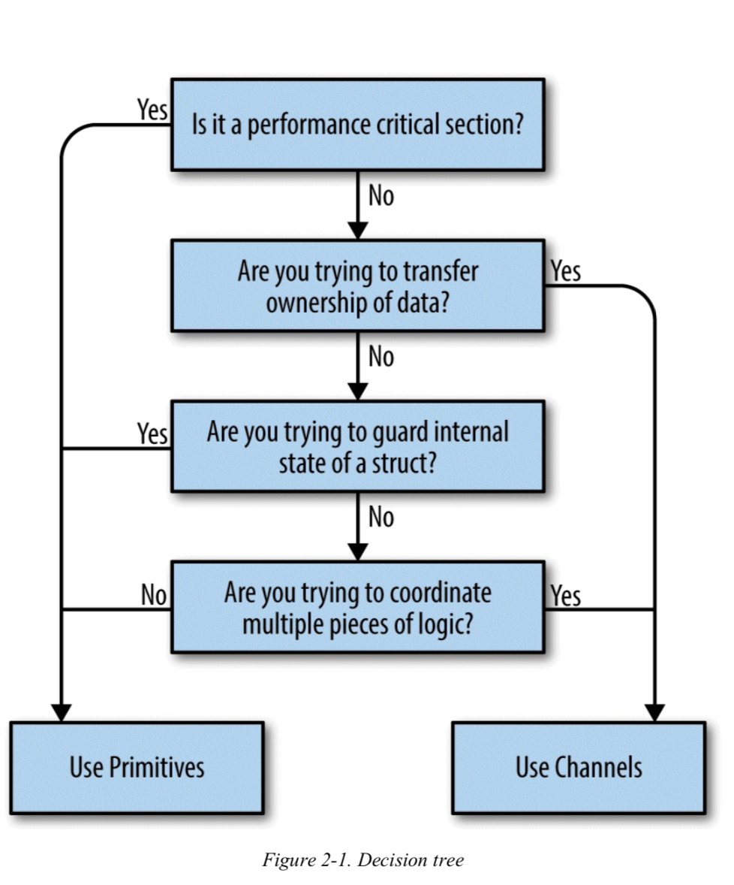
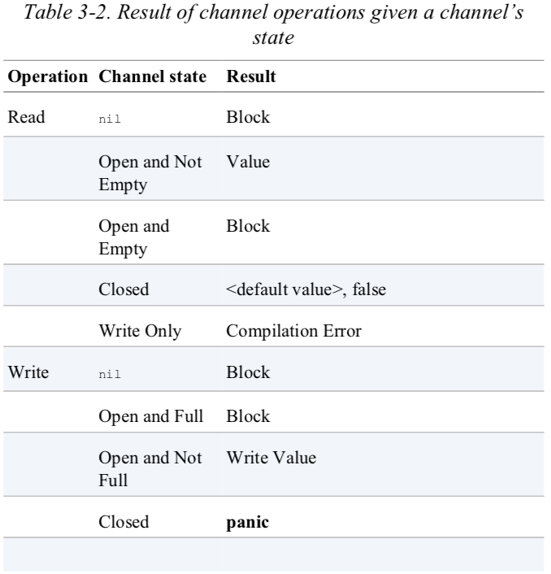

《Concurrency In Go》

# 1 An Introduction to Concurrency


critical section（临界区）：for a section of your program needs exclusive access to a shared resource.


### Deadlocks, Livelocks, and Starvation

Deadlocks conditions:

- Mutual Exclusion
- Wait For Condition
- No Preemption
- Circular Wait

Livelocks: 活锁。想象两个人迎面走来，一个人向一边转，然后另一个人也同方向转，如此循环一直僵持谁都过不去。

Starvation: 饥饿 ，一个并发的进程无法获取所有需要工作的资源。一个贪心的进程阻止其他进程获取执行资源。

### Determining Concurrency Safety

- who is responsible for the Concurrency?
- how is the problem space mapped onto concurrency primitives?
- who is responsible for the synchronization?

```go
func CalculatePi(begin,end int64, pi *Pi)
func CalculatePi(begin,end int64) []int64
func CalculatePi(bengin,end int64) <-chan uint
```

### Simplicity in the Face of Complexity


# 2 Modeling Your Code: Communicating Sequential Processes

### Concurrency vs Parallelism

Concurrency is a property of the code; parallelism is a property of the runnning programm.

### What Is CAP?

### Go's Philosophy on Concurrency

CSP primitives or Memory access synchronizations.
Use whichever is most expressive and/or most simple.



Aim for simplicity, use channels when possible, and treat goroutines like a free resource.


# 3 Go's Concurrency Building Blocks

Coroutines are simply concurrent subroutines(functions, clousures or methods in Go) that are nonpreemptive.

Go follows a model of concurrency called the fork-join model.


```go
var wg sync.WaitGroup

sayHello := func() {
	defer wg.Done()
	fmt.Println("hello")
}
wg.Add(1)
go sayHello()
wg.Wait() # this is the join point
```

### The sync Package

The sync package contains the concurrency primitives that are most useful for low-level memory access synchronization.

#### WaitGroup

Wait for a set of concurrent operations to complete when you either don't care about the result of the concurrent
operations , or you have other means of collecting their results.
```go
package main

import (
	"fmt"
	"sync"
	"time"
)

func main() {
	var wg sync.WaitGroup

	wg.Add(1)
	go func() {
		defer wg.Done()
		fmt.Println("1st goroutine sleeping...")
		time.Sleep(1)
	}()

	wg.Add(1)
	go func() {
		defer wg.Done()
		fmt.Println("2nd goroutine sleeping...")
		time.Sleep(2)
	}()

	wg.Wait()
	fmt.Println("All goroutines complete")
}
```

#### Mutex and RWMutex

```go
// Mutex demo
package main

import (
	"fmt"
	"sync"
)

func main() {
	var count int
	var lock sync.Mutex

	incr := func() {
		lock.Lock()
		defer lock.Unlock()
		count++
		fmt.Printf("Incr: %d\n", count)
	}

	decr := func() {
		lock.Lock()
		defer lock.Unlock()
		count--
		fmt.Printf("Decr: %d\n", count)
	}

	var arithmetic sync.WaitGroup
	for i := 0; i <= 5; i++ {
		arithmetic.Add(1)
		go func() {
			defer arithmetic.Done()
			incr()
		}()
	}

	for i := 0; i <= 5; i++ {
		arithmetic.Add(1)
		go func() {
			defer arithmetic.Done()
			decr()
		}()
	}

	arithmetic.Wait()
	fmt.Println("Done")
}
```

RWMutex: 适合读多写少场景。可以获取多个读锁，除非锁用来持有写入。


#### Cond

A rendezvous point for goroutine waiting for or announcing the occurrence of an event.

```
for conditoinTrue() == false{
	time.Sleep(1*time.Millisecond) //sleep多久是个问题，太久效率低下，太快消耗 cpu
}
```
use Cond, we cloud write like this:

```
c := sync.NewCond(&sync.Mutex{})
c.L.Lock()
for conditoinTrue() == false {
	c.Wait() // blocking call, will suspend
}
c.L.UnLock()
```
考虑有一个固定长度为2的队列，10个 items 想要 push 进去。
只要有空间我们就希望入队，被尽早通知。

```
package main

import (
	"fmt"
	"sync"
	"time"
)

func main() {
	c := sync.NewCond(&sync.Mutex{})
	queue := make([]interface{}, 0, 10)

	removeFromQueue := func(delay time.Duration) {
		time.Sleep(delay)
		c.L.Lock() // enter the critical section
		queue = queue[1:] //simulate dequeuing an item
		fmt.Println("removed from queue")
		c.L.Unlock() // exit critical section
		c.Signal() // let a goroutine waiting on the condition know that something has occured
	}

	for i := 0; i < 10; i++ {
		c.L.Lock() //进入临界区, critical section
		for len(queue) == 2 {
			c.Wait() //will suspend the main goroutine until a signal on the condition has been sent
		}
		fmt.Println("Adding to queue")
		queue = append(queue, struct{}{})
		go removeFromQueue(1 * time.Second)
		c.L.Unlock() //exit critical section
	}
}
```
#### Once

only one call to "Do", even on different goroutines.

```
package main

import (
	"fmt"
	"sync"
)

func main() {
	var count int

	increment := func() {
		count++
	}

	var once sync.Once
	var wg sync.WaitGroup
	wg.Add(100)
	for i := 0; i < 100; i++ {
		go func() {
			defer wg.Done()
			once.Do(increment)
		}()
	}
	wg.Wait()
	fmt.Printf("count is %d\n", count) //1
}
```
NOTES: sync.Once only counts the number of times Do is Called, not
how many times unique functions passed into Do are called.

```
package main

import (
	"fmt"
	"sync"
)

func main() {
	var count int
	increment := func() { count++ }
	decremet := func() { count-- }

	var once sync.Once
	once.Do(increment)
	once.Do(decremet)
	fmt.Printf("count is %d\n", count) //1
}
```

#### Pool

Pool is a concurrent-safe implementation of the object pool pattern.

```
myPool := &sync.Pool{
	New: func() interface{}{
		fmt.Println("Creating new instance.")
		return struct{}{}
	},
}

myPool.Get()
instance:=myPool.Get()
myPool.Put(instance)
myPool.Get()
```

Another common situation where a Pool is useful is for warming a cache of pre-allocated
objects for operations that must run as quickly as possible.

When working with sync.Pool:

- give it a New member variable that is thread-safe when called
- when receive an instance from Get,make no assumptions regarding the state of the object you receive back
- Make sure to call Put when you're finished with the object you pulled out of the pool.(with defer)
- Objects in the pool must be roughly uniform in makeup


### Channels

Go weill implicitly convert bidirectional channels to unidirectional channels when needed.

```
var receiveChan <- chan interface{}
var sendChan chan <- interface{}
dataStream := make(chan interface{})
//valid statements
receiveChan = dataStream
sendChan = dataStream
```

Unbufferd channel in Go are said to be blocking.

```
val, ok := <-stringStream
```

The second return value is a way for a read operation to indicate whether the read off the channel
was a value generated by a write elsewhere in the process, or a default value generated from a closed channel.

We can use "for range" iter channel, it will automatically break the loop when cahnnel is closed.

Buffred channels, even if no reads are performed on the channel, a goroutine can still perform n writes.
You can treat buffered channels are an inmemory FIFO queue for concurrent processes to communicate over.




The first thing we should do to put channels in the right context is to assign channel ownership.

- Instaniate the channel.
- Perform writes, os pass ownership to another goroutine.
- Close the channel
- Ecapsulate the previous three things in this list and expose them via a reader channel.

As a consumer of a channel, I only have to worry about two things.

- Knowing when a channel is closed (use val, ok)
- Responsibly handling blocking for any reason

```
// keep the scope of channel ownership small
func main() {

	chanOwner := func() <-chan int {
		resultStream := make(chan int, 5)
		go func() {
			defer close(resultStream)
			for i := 0; i <= 5; i++ {
				resultStream <- i
			}
		}()
		return resultStream // will implicityly converted to read-only for consumers
	}

	resultStream := chanOwner()
	for result := range resultStream {
		fmt.Printf("received : %d\n", result)
	}

	fmt.Println("Done receiving!")
}
```

### The select Statement

The select statement is the glue that binds channels together,
it can help safely bring channels together with concepts like cancellations, timeouts, waiting, and default values.


```
func main() {
	// a bit like switch
	var c1, c2 <-chan interface{}
	var c3 chan<- interface{}
	// all channels reads and writes are considered simultaneously to see if any of them are ready
	// populated or closed channels in the case of reads, and channels that are not at capacity in the case of writes
	// if none of the channels are ready, the entire select statement blocks
	select {
	case <-c1:
		// do something
	case <-c2:
		// do something
	case c3 <- struct{}{}:
		// do something
	}
}
```

- What happens when multiple channels have something to read?
	- random select, each has an equal  chance of being selected as all the others


```
func main() {
	c1 := make(chan interface{})
	close(c1)
	c2 := make(chan interface{})
	close(c2)
	var c1Count, c2Count int
	for i := 1000; i >= 0; i-- {
		select {
		case <-c1:
			c1Count++
		case <-c2:
			c2Count++
		}
	}
	fmt.Printf("c1: %d\n, c2: %d\n", c1Count, c2Count)
}
```

- What if there are never any channels that become ready?
	- you may want to timeout

```
func main() {
	var c <-chan int
	select {
	case <-c:
	case <-time.After(1 * time.Second):
		fmt.Println("Time out")
	}
}
```

- what if we want to do something but no channels are currently ready?
	- use default
	- this allows a goroutine to make progress on work while waiting for another goroutine to report a result

```
func main() {
	start := time.Now()
	var c1, c2 <-chan int
	select {
	case <-c1:
	case <-c2:
	default:
		fmt.Printf("In default after %v\n\n", time.Since(start))
	}
}
```


```
func main() {
	done := make(chan interface{})
	go func() {
		time.Sleep(5 * time.Second)
		close(done)
	}()
	workCounter := 0
loop:
	for {
		select {
		case <-done:
			break loop
		default:
		}
		// simulate work
		workCounter++
		time.Sleep(1 * time.Second)
	}
	fmt.Printf("Achieved %v cycles of work before signalled to stop.\n", workCounter)
}
```
###### empty select
`seelct {}` will block forever.


### The GOMAXPROCS lever

this function controls the number of OS threads that will host so-called "work queues"


# 4. Concurrency Patterns in Go

### Confinement(限制)

When working with concurrent code

- Synchronization primitives for sharing memory (sync.Mutex)
- Synchronization via Communicating (channels)
- Immutable Data (copy of values)
- Data protected by confinement (ad hoc and lexical)


```
func main() {
	// confines the write aspect of this channel to prevent other goroutines from writing to it
	chanOnwer := func() <-chan int {
		results := make(chan int, 5)
		go func() {
			defer close(results)
			for i := 0; i <= 5; i++ {
				results <- i
			}
		}()
		return results
	}

	consumer := func(results <-chan int) {
		for result := range results {
			fmt.Printf("Received : %d\n", result)
		}
		fmt.Println("Done receiving!")
	}

	results := chanOnwer()
	consumer(results)
}
```
### The for-select Loop

- Sending iteration variables out on a channel

```
	for _, s := range []string{"a", "b", "c"} {
		select {
		case <-done:
			return
		case stringStream <- s:
		}
	}
```

- Looping infinitely waiting to be stopped

```
	for {
		select {
		case <-done:
			return
		default:
		}
		// do non-preemptable work
	}
```

	for {
		select {
		case <-done:
			return
		default:
		}
		// do non-preemptable work
	}
