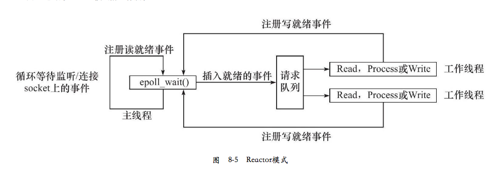
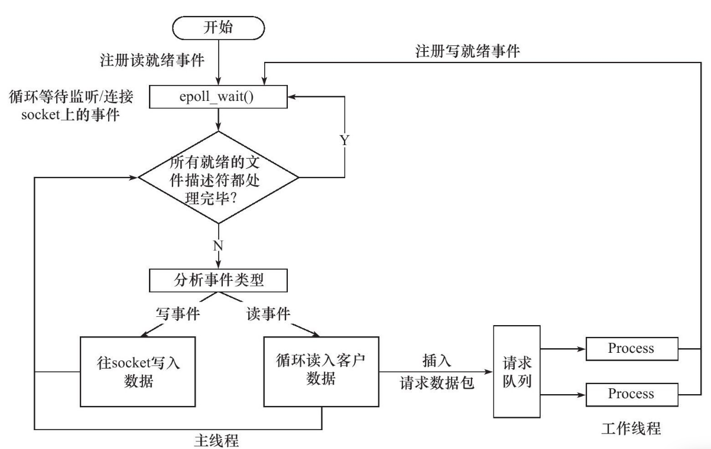
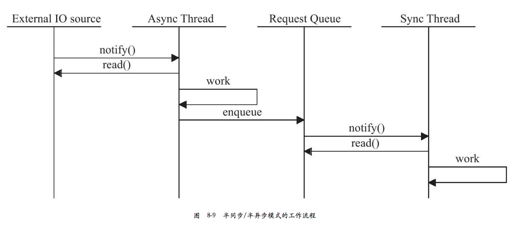
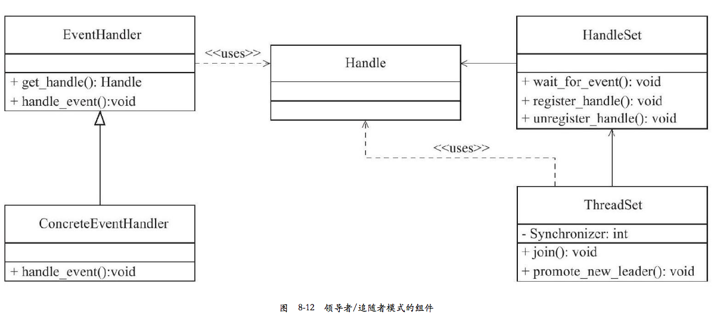
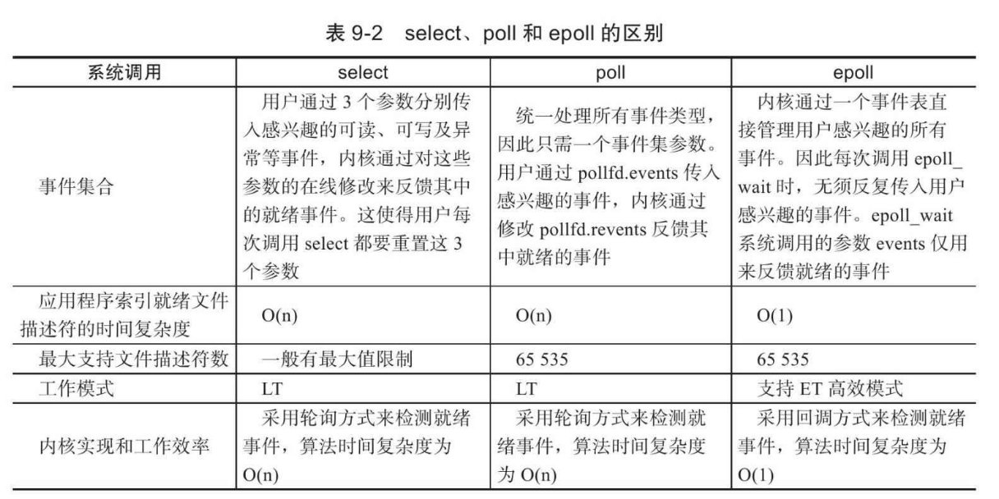
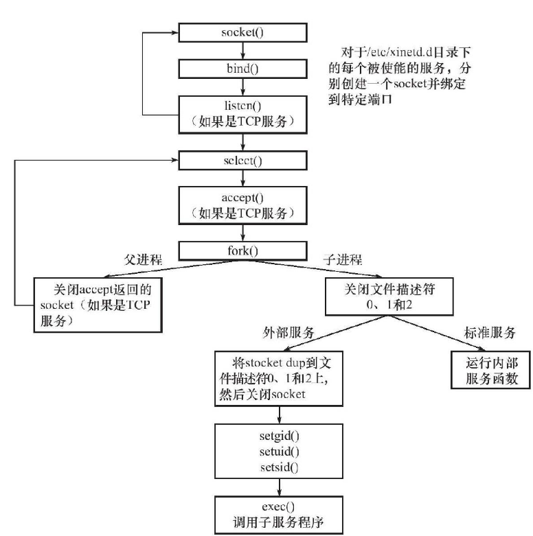
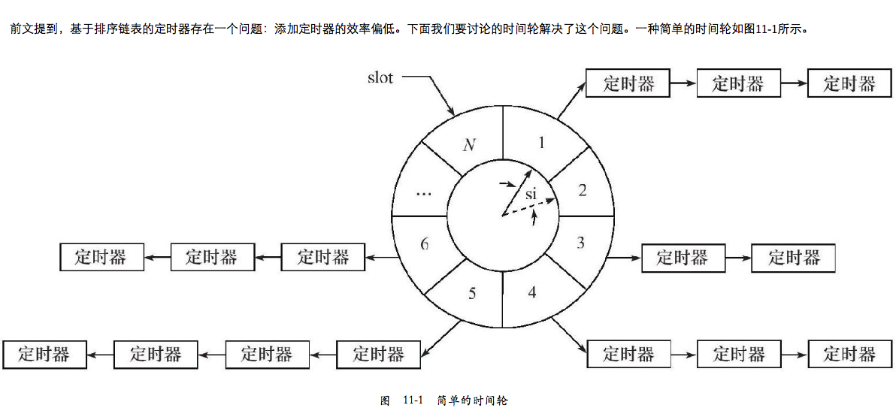
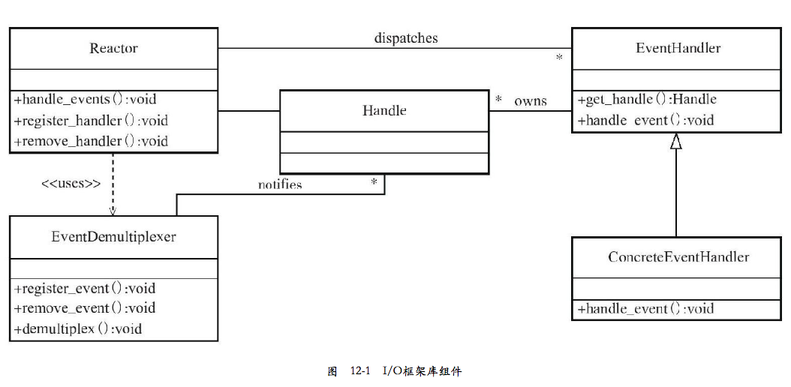
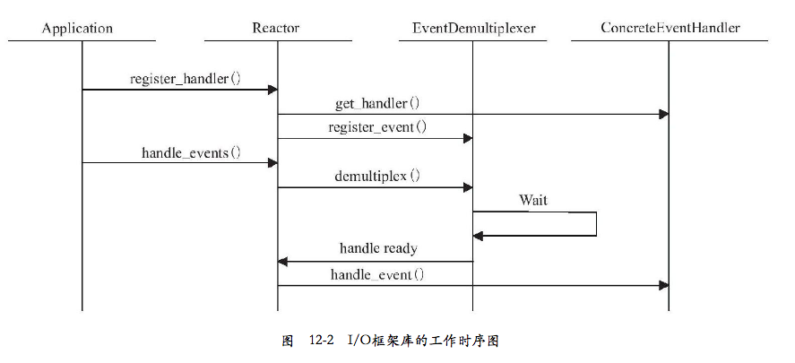

# 1章 TCP/IP 协议族详解

linux 使用 /etc/resolv.conf 存放 DNS 服务器的 IP 地址
数据链路层、网络层、传输层在内核实现的，操作系统提供了一组系统调用 api: socket

# 2章 IP 协议详解

- IP 头部：出现在每个 IP 数据报中，用于指定 IP 通信的源IP地址、目的IP地址、指导IP 分片和重组
- IP 数据报的路由和转发

IP协议为上层提供无状态、无连接、不可靠的服务，使用 IP 协议的上层协议（比如TCP）需要自己实现数据确认、超时重传等机制。

# 3章 TCP 协议详解

### 3.1 TCP 服务的特点

面向连接、字节流、可靠传输
字节流：应用程序对数据的发送和接受是没有边界限制的。

TCP: send, recv
UDP: sendto() recvfrom()

### 3.2 TCP 头部信息

RTT: Round Trip Time
可以用 tcpdump 工具来检查

TCP状态转移，当前状态可以用 netstat 命令查看

如果客户端向处于半打开状态的连接写入数据，对方将回应一个复位报文段

# 4 TCP/IP 通信案例:访问 Internet 上的 web 服务

使用了 squid http 代理服务器.
- 正向代理：客户端自己设置代理服务器地址。每次请求发给代理服务器，由代理服务器请求资源
- 反向代理：设置在服务端，用代理服务器接受连接请求，然后请求转发给内部网络上的服务器。所以不同地方 ping 一个域名可能获取到不同的 ip 地址
- 透明代理：只能设置在网关上。可以看做正向代理的一种特殊情况

HTTP 应用层协议，一般使用 TCP 协议作为传输层。 wget 用 squid 代理服务器 tcpdump -X 抓包


# 5 Linux 网络编程基础 API

### 5.1 socket 地址 API
主机字节序：现代 cpu 一次能装载至少4个字节，这 4 个字节在内存中的排列顺序影响它被累加器装载成的整数的值
分为
- 大端字节序(big endian) : 一个整数的高位字节存储在内存的低地址处
- 小端字节序(little endian): 高位字节存储在高地址处

现在pc大多采用小端字节序（也被称为主机字节序）。
不同字节序在网络之间传输会有问题，解决方法是发送端总是转成大端字节序，接收端自行决定是否要转换。大端字节序也因此成为
网络字节序。linux 提供了 4 个函数完成主机字节序（小端）和网络字节序（大端）的转换：
(python socket.htonl)

```c
# include <netinet.h>
unsigned long int htonl(unsigned long int  hostlong)  // host to network long
unsigned short int htons(unsigned short int  hostshort)
unsigned long int ntoh(unsigned long int netlong)
unsigned short int ntohs(unsigned short int netshort)
```

socket 编程接口中表示 socket 地址的结构 sockaddr:

```c
#include <bits/socket.h>
struct sockaddr{
sa_family_t sa_family;   // 地址族 AF_UNIX, AF_INET, AF_INET6
char sa_data[14];  // 存放 socket 地址
}
```

ip 地址转换

```c
#include＜arpa/inet.h＞
in_addr_t inet_addr(const char*strptr);
int inet_aton(const char*cp,struct in_addr*inp);
char*inet_ntoa(struct in_addr in);
```

### 5.2 创建 socket
unix 一切皆文件， socket 就是可读、可写、可控制、可关闭的文件描述符

```c
#include＜sys/types.h＞
#include＜sys/socket.h＞
int socket(int domain,int type,int protocol);
```

### 5.3 命名 socket
将一个 socket 和socket 地址绑定称为给 socket 命名。

```c
#include＜sys/types.h＞
#include＜sys/socket.h＞
int bind(int sockfd,const struct sockaddr*my_addr,socklen_t addrlen);
```

### 5.4 监听 socket
bind 后还需要创建一个监听队列存放待处理的客户端连接

```c
#include＜sys/types.h＞
#include＜sys/socket.h＞
int listen(int sockfd, int backlog);
```

监听队列的长度如果超过backlog，服务器将不受理新的客户连接，客户端也将收到ECONNREFUSED错误信息。在内核版本2.2之前的Linux中，backlog参数是指所有处于半连接状态（SYN_RCVD）和完全连接状态（ESTABLISHED）的socket的上限。但自内核版本2.2之后，它只表示处于完全连接状态的socket的上限，处于半连接状态的socket的上限则由/proc/sys/net/ipv4/tcp_max_syn_backlog内核参数定义。backlog参数的典型值是5。

### 5.5 接受连接

```c
#include＜sys/types.h＞
#include＜sys/socket.h＞
int accept(int sockfd, struct sockaddr *addr, socklen_t *addrlen);
```
accept 成功时返回一个新的连接 socket，其唯一标识了被接受的这个连接，服务器可以通过读写该 socket 来与被接受连接
的对应客户端通信。
注意 accept 只是从监听队列中取出连接，而不论连接处于何种状态，更不关心网络的变化。
我们把执行过listen调用、处于 LISTEN 状态的 socket 称为监听 socket， 而所有处于 ESTABLISHED 状态的 socket 称为
连接socket.

### 5.6 发起连接
服务器通过listen 被动接受连接，客户端需要通过 connect 主动与服务器建立连接

```c
#include＜sys/types.h＞
#include＜sys/socket.h＞
int connect(int sockfd, const struct sockaddr *serv_addr, socklen_t addrlen);
```
一旦成功建立连接，sockfd就唯一地标识了这个连接，客户端就可以通过读写sockfd来与服务器通信。connect失败则返回-1并设置errno。其中两种常见的errno是ECONNREFUSED和ETIMEDOUT，

### 5.7 关闭连接

```c
#include<unistd.h>
int close(int fd);  // fd 引用计数-1
```

有个专门为网络编程设计的函数，无论如何都会立即终止连接

```c
#include＜sys/socket.h＞
int shutdown(int sockfd,int howto)  // SHUT_RD, SHUT_WR, SHUT_RDWR
```

### 5.8 socket 数据读写
对于文件读写操作 read/write 同样适用于socket，不过socket 提供了专门的系统调用

```c
#include＜sys/types.h＞
#include＜sys/socket.h＞
ssize_t recv(int sockfd,void*buf,size_t len,int flags);
ssize_t send(int sockfd,const void*buf,size_t len,int flags);
```

udp 数据包读写系统调用（亦可以用于 stream）:

```c
#include＜sys/types.h＞
#include＜sys/socket.h＞
ssize_t recvfrom(int sockfd,void*buf,size_t len,int flags,struct sockaddr*src_addr,socklen_t*addrlen);
ssize_t sendto(int sockfd,const void*buf,size_t len,int flags,const struct sockaddr*dest_addr,socklen_t addrlen)
```

通用数据读写函数：

```c
#include＜sys/socket.h＞
ssize_t recvmsg(int sockfd,struct msghdr*msg,int flags);
ssize_t sendmsg(int sockfd,struct msghdr*msg,int flags);
```

# 5.9 带外标记
linux 检测到 TCP 紧急标志时，将通知应用程序有带外数据需要接收。内核通知应用程序带外数据到达有两种常见方式：
I/O复用产生的异常事件和 SIGURG 信号

```c
#include＜sys/socket.h＞
int sockatmark(int sockfd);
```
sockatmark判断sockfd是否处于带外标记，即下一个被读取到的数据是否是带外数据。如果是，sockatmark返回1，此时我们就可以利用带MSG_OOB标志的recv调用来接收带外数据。如果不是，则sockatmark返回0。

# 5.10 地址信息函数
同样 python 在 socket 模块可以查到

```c
#include＜sys/socket.h＞
// 获取 sockfd 对应的本端 socket 地址，存储在aaddress 参数指定的内存中
int getsockname(int sockfd,struct sockaddr*address,socklen_t*address_len);
// 获取 sockfd 对应的远端 socket 地址
int getpeername(int sockfd,struct sockaddr*address,socklen_t*address_len);
```

# 5.11 socket 选项
下面两个系统调用则是专门用来读取和设置socket文件描述符属性的方法：

```c
#include＜sys/socket.h＞
int getsockopt(int sockfd,int level,int option_name,void*option_value,socklen_t*restrict option_len);
int setsockopt(int sockfd,int level,int option_name,const void*option_value,socklen_t option_len);
```
常用:
- SO_REUSEADDR: 强制使用被处于 TIME_WAIT 状态的连接占用的 socket 地址
- SO_RCVBUF/SO_SNDBUF: 表示TCP 接收缓冲区和发送缓冲区的大小
- SO_RECLOWAT/SO_SNDLOWAT: 表示TCP 接收缓冲区和发送缓冲区的低水位标记，一般被I/O
  复用系统调用用来判断socket是否可读或者可写（默认1字节）
- SO_LINGER: 控制close系统调用在关闭TCP连接时候的行为

 # 5.12 网络信息 API

```c
#include＜netdb.h＞
// 根据主机名获取主机的完整信息
struct hostent*gethostbyname(const char*name);
// 根据 IP 地址获取主机的完整信息
struct hostent*gethostbyaddr(const void*addr,size_t len,int type);

//getservbyname函数根据名称获取某个服务的完整信息，
struct servent*getservbyname(const char*name,const char*proto);
// getservbyport函数根据端口号获取某个服务的完整信息。它们实际上都是通过读取/etc/services文件来获取服务的信息的
struct servent*getservbyport(int port,const char*proto);

// getaddrinfo函数既能通过主机名获取ip地址，也能通过服务名获取端口号
int getaddrinfo(const char*hostname,const char*service,const struct addrinfo*hints,struct addrinfo**result);

// getnameinfo函数能通过socket地址同时获得以字符串表示的主机名（内部使用的是gethostbyaddr函数）和服务名（内部使用的是getservbyport函数）
int getnameinfo(const struct sockaddr*sockaddr,socklen_t addrlen,char*host,socklen_t hostlen,char*serv,socklen_t servlen,int flags);
```

上述4个函数都是不可重入的，即非线程安全的。 <netdb.h> 给出了可重入版本


# 6 高级 IO 函数

# 6.1 pipe 函数
创建一个管道以实现进程间通信

```c
#include <unistd.h>
int pipe(inf fd[2]);  // f[0] 只能用于从管道读取数据， f[1] 写数据

#include＜sys/types.h＞
#include＜sys/socket.h＞
int socketpair(int domain,int type,int protocol,int fd[2]);
```

# 6.2 dup/dup2 函数
有时我们希望把标准输入重定向到一个文件，或者把标准输出重定向到一个网络连接（比如CGI编程）。这可以通过下面的用于复制文件描述符的dup或dup2函数来实现：
```c
#include＜unistd.h＞
int dup(int file_descriptor);
int dup2(int file_descriptor_one,int file_descriptor_two);
```
dup函数创建一个新的文件描述符，该新文件描述符和原有文件描述符file_descriptor指向相同的文件、管道或者网络连接。并且dup返回的文件描述符总是取系统当前可用的最小整数值。dup2和dup类似，不过它将返回第一个不小于file_descriptor_two的整数值。dup和dup2系统调用失败时返回-1并设置errno。

# 6.3 readv/writev 函数

readv函数将数据从文件描述符读到分散的内存块中，即分散读；writev函数则将多块分散的内存数据一并写入文件描述符中，即集中写。它们的定义如下：

```c
#include＜sys/uio.h＞
ssize_t readv(int fd,const struct iovec*vector,int count)；
ssize_t writev(int fd,const struct iovec*vector,int count);
```

# 6.4 sendfile 函数

sendfile函数在两个文件描述符之间直接传递数据（完全在内核中操作），从而避免了内核缓冲区和用户缓冲区之间的数据拷贝，效率很高，这被称为零拷贝。sendfile函数的定义如下：
```c
#include＜sys/sendfile.h＞
ssize_t sendfile(int out_fd,int in_fd,off_t*offset,size_t count);
```

in_fd参数是待读出内容的文件描述符，out_fd参数是待写入内容的文件描述符。offset参数指定从读入文件流的哪个位置开始读，如果为空，则使用读入文件流默认的起始位置。count参数指定在文件描述符in_fd和out_fd之间传输的字节数。sendfile成功时返回传输的字节数，失败则返回-1并设置errno。该函数的man手册明确指出，in_fd必须是一个支持类似mmap函数的文件描述符，即它必须指向真实的文件，不能是socket和管道；而out_fd则必须是一个socket。由此可见，sendfile几乎是专门为在网络上传输文件而设计的。

# 6.5 mmap/munmap 函数
mmap函数用于申请一段内存空间。我们可以将这段内存作为进程间通信的共享内存，也可以将文件直接映射到其中。munmap函数则释放由mmap创建的这段内存空间。它们的定义如下：

```c
#include＜sys/mman.h＞
void*mmap(void*start,size_t length,int prot,int flags,int fd,off_t offset);
int munmap(void*start,size_t length);
```

# 6.6 splice 函数
splice函数用于在两个文件描述符之间移动数据，也是零拷贝操作。splice函数的定义如下：

```c
#include＜fcntl.h＞
ssize_t splice(int fd_in,loff_t*off_in,int fd_out,loff_t*off_out,size_t len,unsigned int flags);
```

# 6.7 tee
tee函数在两个管道文件描述符之间复制数据，也是零拷贝操作。它不消耗数据，因此源文件描述符上的数据仍然可以用于后续的读操作。tee函数的原型如下：

```c
#include＜fcntl.h＞
ssize_t tee(int fd_in,int fd_out,size_t len,unsigned int flags);
```

# 6.8 fcntl 函数 (file control)

```c
#include＜fcntl.h＞
int fcntl(int fd,int cmd,…);
```


# 7 Linux 服务器程序规范

### 7.1 日志
linux 提供一个守护进程 来处理日志系统 rsyslogd
应用程序使用syslog函数与rsyslogd守护进程通信。syslog函数的定义如下：

```c
#include＜syslog.h＞
void syslog(int priority,const char*message,...);
```

### 7.2 用户信息

用户信息对于服务器程序的安全性来说是很重要的，比如大部分服务器就必须以root身份启动，但不能以root身份运行。下面这一组函数可以获取和设置当前进程的真实用户ID（UID）、有效用户ID（EUID）、真实组ID（GID）和有效组ID（EGID）：

```c
#include＜sys/types.h＞
#include＜unistd.h＞
uid_t getuid();/*获取真实用户ID*/,
uid_t geteuid();/*获取有效用户ID*/
gid_t getgid();/*获取真实组ID*/
gid_t getegid();/*获取有效组ID*/
int setuid(uid_t uid);/*设置真实用户ID*/
int seteuid(uid_t uid);/*设置有效用户ID*/
int setgid(gid_t gid);/*设置真实组ID*/
int setegid(gid_t gid);/*设置有效组ID*/
```

### 7.3 进程间关系
Linux下每个进程都隶属于一个进程组，因此它们除了PID信息外，还有进程组ID（PGID）。我们可以用如下函数来获取指定进程的PGID：

```c
#include＜unistd.h＞
pid_t getpgid(pid_t pid);
```

Linux下每个进程都隶属于一个进程组，因此它们除了PID信息外，还有进程组ID（PGID）。我们可以用如下函数来获取指定进程的PGID：
```c
#include＜unistd.h＞
pid_t getpgid(pid_t pid);
```

### 7.4 系统资源限制
Linux上运行的程序都会受到资源限制的影响，比如物理设备限制（CPU数量、内存数量等）、系统策略限制（CPU时间等），以及具体实现的限制（比如文件名的最大长度）。Linux系统资源限制可以通过如下一对函数来读取和设置：

```c
#include＜sys/resource.h＞
int getrlimit(int resource,struct rlimit*rlim);
int setrlimit(int resource,const struct rlimit*rlim);
```

### 7.5 改变工作目录和根目录

获取进程当前工作目录和改变进程工作目录的函数分别是：

```c
# include＜unistd.h＞
char*getcwd(char*buf,size_t size);
int chdir(const char*path);
```

### 7.6 服务器程序后台化

```c
#include＜unistd.h＞
int daemon(int nochdir,int noclose);
```


# 8 高性能服务器程序框架

- I/O 处理单元: 四种 IO 模型，两种高效事件处理模式
- 逻辑单元: 两种高效的并发模式，以及高效的逻辑处理方式-有限状态机
- 存储单元

### 8.1 服务器模型
- C/S 模型: server 端压力大
- P2P 模型: 网络负载高 (可以看成C/S 模型的扩展)


### 8.2 服务器编程框架

- IO 处理单元：服务器管理客户端连接的框架，通常等待并接受新的客户端连接，接受客户端数据，将服务器响应返回给客户端.
但是数据收发不一定在IO 处理单元，也可能在逻辑单元中执行，取决于事件处理模式。
- 逻辑单元：通常是一个线程或者进程，分析并处理客户端数据，然后把结果传递给 IO 处理单元或者直接发送客户端
- 网络存储单元：数据库、缓存、文件等，非必须的
- 请求队列：各单元之间的通信方式的抽象，通常被实现为池的一部分。对于服务器机群，请求队列是服务器之间预先建立、静态的、永久的
TCP 连接

### 8.3 I/O 模型
socket 创建的时候默认是阻塞的，可以传递参数设置成非阻塞。

针对阻塞I/O执行的系统调用可能因为无法立即完成而被操作系统挂起，直到等待的事件发生为止。比如，客户端通过connect向服务器发起连接时，connect将首先发送同步报文段给服务器，然后等待服务器返回确认报文段。如果服务器的确认报文段没有立即到达客户端，则connect调用将被挂起，直到客户端收到确认报文段并唤醒connect调用。socket的基础API中，可能被阻塞的系统调用包括accept、send、recv和connect。

针对非阻塞I/O执行的系统调用则总是立即返回，而不管事件是否已经发生。如果事件没有立即发生，这些系统调用就返回-1，和出错的情况一样。此时我们必须根据errno来区分这两种情况。对accept、send和recv而言，事件未发生时errno通常被设置成EAGAIN（意为“再来一次”）或者EWOULDBLOCK（意为“期望阻塞”）；对connect而言，errno则被设置成EINPROGRESS

很显然，我们只有在事件已经发生的情况下操作非阻塞I/O（读、写等），才能提高程序的效率。因此，非阻塞I/O通常要和其他I/O通知机制一起使用，比如I/O复用和SIGIO信号。

I/O复用是最常使用的I/O通知机制。它指的是，应用程序通过I/O复用函数向内核注册一组事件，内核通过I/O复用函数把其中就绪的事件通知给应用程序。Linux上常用的I/O复用函数是select、poll和epoll_wait，我们将在第9章详细讨论它们。需要指出的是，I/O复用函数本身是阻塞的，它们能提高程序效率的原因在于它们具有同时监听多个I/O事件的能力。

### 8.4 两种高效的事件处理模式

服务器程序通常需要处理三类事件 I/O 事件、信号及定时事件。
两种高效事件处理模式：

 - Reactor: 同步 I/O 模型通常用于实现 Reactor
 Reactor是这样一种模式，它要求主线程（I/O处理单元，下同）只负责监听文件描述上是否有事件发生，有的话就立即将该事件通知工作线程（逻辑单元，下同）。除此之外，主线程不做任何其他实质性的工作。读写数据，接受新的连接，以及处理客户请求均在工作线程中完成。

使用同步I/O模型（以epoll_wait为例）实现的Reactor模式的工作流程是：

1. 主线程往epoll内核事件表中注册socket上的读就绪事件。
2. 主线程调用epoll_wait等待socket上有数据可读。
3. 当socket上有数据可读时，epoll_wait通知主线程。主线程则将socket可读事件放入请求队列。
4. 睡眠在请求队列上的某个工作线程被唤醒，它从socket读取数据，并处理客户请求，然后往epoll内核事件表中注册该socket上的写就绪事件。
5. 主线程调用epoll_wait等待socket可写。
6. 当socket可写时，epoll_wait通知主线程。主线程将socket可写事件放入请求队列。
7. 睡眠在请求队列上的某个工作线程被唤醒，它往socket上写入服务器处理客户请求的结果。



 - Proactor: 异步 I/O 模型则用于实现 Proactor 模式。与Reactor模式不同，Proactor模式将所有I/O操作都交给主线程和内核来处理，工作线程仅仅负责业务逻辑。因此，Proactor模式更符合图8-4所描述的服务器编程框架。

使用异步I/O模型（以aio_read和aio_write为例）实现的Proactor模式的工作流程是：

1. 主线程调用aio_read函数向内核注册socket上的读完成事件，并告诉内核用户读缓冲区的位置，以及读操作完成时如何通知应用程序（这里以信号为例，详情请参考sigevent的man手册）。
2. 主线程继续处理其他逻辑。
3. 当socket上的数据被读入用户缓冲区后，内核将向应用程序发送一个信号，以通知应用程序数据已经可用。
4. 应用程序预先定义好的信号处理函数选择一个工作线程来处理客户请求。工作线程处理完客户请求之后，调用aio_write函数向内核注册socket上的写完成事件，并告诉内核用户写缓冲区的位置，以及写操作完成时如何通知应用程序（仍然以信号为例）。
5. 主线程继续处理其他逻辑。
6. 当用户缓冲区的数据被写入socket之后，内核将向应用程序发送一个信号，以通知应用程序数据已经发送完毕。
7. 应用程序预先定义好的信号处理函数选择一个工作线程来做善后处理，比如决定是否关闭socket。


- 使用同步方式模拟 Proactor 模式。 其原理是：主线程执行数据读写操作，读写完成之后，主线程向工作线程通知这一“完成事件”。那么从工作线程的角度来看，它们就直接获得了数据读写的结果，接下来要做的只是对读写的结果进行逻辑处理。

使用同步I/O模型（仍然以epoll_wait为例）模拟出的Proactor模式的工作流程如下：

1. 主线程往epoll内核事件表中注册socket上的读就绪事件。
2. 主线程调用epoll_wait等待socket上有数据可读。
3. 当socket上有数据可读时，epoll_wait通知主线程。主线程从socket循环读取数据，直到没有更多数据可读，然后将读取到的数据封装成一个请求对象并插入请求队列。
4. 睡眠在请求队列上的某个工作线程被唤醒，它获得请求对象并处理客户请求，然后往epoll内核事件表中注册socket上的写就绪事件。
5. 主线程调用epoll_wait等待socket可写。
6. 当socket可写时，epoll_wait通知主线程。主线程往socket上写入服务器处理客户请求的结果。



### 8.5 两种高效的并发模式

- 半同步/半异步(half-sync/half-async): 同步线程用来处理客户逻辑，异步线程处理I/O事件


- 领导者/追随者(Leader/Followers):领导者/追随者模式是多个工作线程轮流获得事件源集合，轮流监听、分发并处理事件的一种模式。在任意时间点，程序都仅有一个领导者线程，它负责监听I/O事件。而其他线程则都是追随者，它们休眠在线程池中等待成为新的领导者。当前的领导者如果检测到I/O事件，首先要从线程池中推选出新的领导者线程，然后处理I/O事件。此时，新的领导者等待新的I/O事件，而原来的领导者则处理I/O事件，二者实现了并发。


### 8.6 有限状态机
逻辑单元内部的一种高效编程方法

### 8.7 提高服务器性能的其他建议
- 池(pool):空间换时间，预先创建并且初始化资源。内存池、进程池、线程池、连接池
- 用户复制：减少不必要的数据复制，尤其是在用户代码和内核之间，零拷贝函数。工作进程之间应该考虑共享内存而不是管道或者消息队列.
- 上下文切换和锁：进程或者线程切换开销；共享资源加锁保护导致服务器效率低下（减小锁的粒度）


# 9章 I/O 复用
I/O 复用使程序能同时监听多个文件描述符，但是它本身是阻塞的，并且当多个文件描述符同时就绪的时候，如果不采用额外措施，
程序只能依次处理其中的每一个文件描述符，如果要实现并发就要用多进程或多线程等编程手段

### 9.1 select 系统调用

select系统调用的用途是：在一段指定时间内，监听用户感兴趣的文件描述符上的可读、可写和异常等事件。

```c
#include＜sys/select.h＞
int select(int nfds,fd_set*readfds,fd_set*writefds,fd_set*exceptfds,struct timeval*timeout);
```

哪些情况下文件描述符可以被认为是可读、可写或者出现异常，对于select的使用非常关键。在网络编程中，下列情况下socket可读：

❑socket内核接收缓存区中的字节数大于或等于其低水位标记SO_RCVLOWAT。此时我们可以无阻塞地读该socket，并且读操作返回的字节数大于0。

❑socket通信的对方关闭连接。此时对该socket的读操作将返回0。

❑监听socket上有新的连接请求。

❑socket上有未处理的错误。此时我们可以使用getsockopt来读取和清除该错误。

下列情况下socket可写：

❑socket内核发送缓存区中的可用字节数大于或等于其低水位标记SO_SNDLOWAT。此时我们可以无阻塞地写该socket，并且写操作返回的字节数大于0。

❑socket的写操作被关闭。对写操作被关闭的socket执行写操作将触发一个SIGPIPE信号。

### 9.2 poll 系统调用
poll系统调用和select类似，也是在指定时间内轮询一定数量的文件描述符，以测试其中是否有就绪者。poll的原型如下：

```c
#include＜poll.h＞
int poll(struct pollfd*fds,nfds_t nfds,int timeout);
struct pollfd
{
  int fd;/*文件描述符*/
  short events;/*注册的事件*/
  short revents;/*实际发生的事件，由内核填充*/
};
```

### 9.3 epoll 系列系统调用

epoll是Linux特有的I/O复用函数。它在实现和使用上与select、poll有很大差异。首先，epoll使用一组函数来完成任务，而不是单个函数。其次，epoll把用户关心的文件描述符上的事件放在内核里的一个事件表中，从而无须像select和poll那样每次调用都要重复传入文件描述符集或事件集。但epoll需要使用一个额外的文件描述符，来唯一标识内核中的这个事件表。这个文件描述符使用如下epoll_create函数来创建：

```c
#include＜sys/epoll.h＞
int epoll_create(int size)
```

size参数现在并不起作用，只是给内核一个提示，告诉它事件表需要多大。该函数返回的文件描述符将用作其他所有epoll系统调用的第一个参数，以指定要访问的内核事件表。下面的函数用来操作epoll的内核事件表：

```c
#include＜sys/epoll.h＞
int epoll_ctl(int epfd,int op,int fd,struct epoll_event*event)
struct epoll_event
{
__uint32_t events;/*epoll事件*/
epoll_data_t data;/*用户数据*/
};
typedef union epoll_data
{
void*ptr;
int fd;
uint32_t u32;
uint64_t u64;
}epoll_data_t;
```

epoll系列系统调用的主要接口是epoll_wait函数。它在一段超时时间内等待一组文件描述符上的事件，其原型如下：

```c
#include＜sys/epoll.h＞
// 该函数成功时返回就绪的文件描述符的个数，失败时返回-1并设置errno。
int epoll_wait(int epfd,struct epoll_event*events,int maxevents,int timeout)
```

epoll对文件描述符的操作有两种模式：LT（Level Trigger，电平触发）模式和ET（Edge Trigger，边沿触发）模式。LT模式是默认的工作模式，这种模式下epoll相当于一个效率较高的poll。当往epoll内核事件表中注册一个文件描述符上的EPOLLET事件时，epoll将以ET模式来操作该文件描述符。ET模式是epoll的高效工作模式。

对于采用LT工作模式的文件描述符，当epoll_wait检测到其上有事件发生并将此事件通知应用程序后，应用程序可以不立即处理该事件。这样，当应用程序下一次调用epoll_wait时，epoll_wait还会再次向应用程序通告此事件，直到该事件被处理。而对于采用ET工作模式的文件描述符，当epoll_wait检测到其上有事件发生并将此事件通知应用程序后，应用程序必须立即处理该事件，因为后续的epoll_wait调用将不再向应用程序通知这一事件。可见，ET模式在很大程度上降低了同一个epoll事件被重复触发的次数，因此效率要比LT模式高。

我们期望的是一个socket连接在任一时刻都只被一个线程处理。这一点可以使用epoll的EPOLLONESHOT事件实现。


### 9.4 三组 I/O 复用函数的比较


### 9.5 I/O 复用高级应用一：非阻塞 connect

### 9.8 超级服务 xinetd

Linux因特网服务inetd是超级服务。它同时管理着多个子服务，即监听多个端口。现在Linux系统上使用的inetd服务程序通常是其升级版本xinetd




# 10章 信号
### 10.1 Linux 信号概述

Linux下，一个进程给其他进程发送信号的API是kill函数。其定义如下：

```c
#include＜sys/types.h＞
#include＜signal.h＞
int kill(pid_t pid,int sig);
```

目标进程在收到信号时，需要定义一个接收函数来处理之。信号处理函数的原型如下：

```c
#include＜signal.h＞
typedef void(*__sighandler_t)(int);
```
信号处理函数只带有一个整型参数，该参数用来指示信号类型。信号处理函数应该是可重入的，否则很容易引发一些竞态条件。所以在信号处理函数中严禁调用一些不安全的函数。

### 10.2 signal 系统调用

要为一个信号设置处理函数，可以使用下面的signal系统调用：

```c
#include＜signal.h＞
_sighandler_t signal(int　sig,_sighandler_t_handler)
```

设置信号处理函数的更健壮的接口是如下的系统调用：

```c
#include＜signal.h＞
int sigaction(int sig,const struct sigaction*act,struct sigaction*oact);
```

### 10.3 信号集函数

Linux使用数据结构sigset_t来表示一组信号。其定义如下：

```c
#include＜bits/sigset.h＞
#define_SIGSET_NWORDS(1024/(8*sizeof(unsigned long int)))
typedef struct
{
unsigned long int__val[_SIGSET_NWORDS];
}__sigset_t;
```

### 10.4 统一事件源
信号是一种异步事件：信号处理函数和程序的主循环是两条不同的执行路线。很显然，信号处理函数需要尽可能快地执行完毕，以确保该信号不被屏蔽（前面提到过，为了避免一些竞态条件，信号在处理期间，系统不会再次触发它）太久。一种典型的解决方案是：把信号的主要处理逻辑放到程序的主循环中，当信号处理函数被触发时，它只是简单地通知主循环程序接收到信号，并把信号值传递给主循环，主循环再根据接收到的信号值执行目标信号对应的逻辑代码。信号处理函数通常使用管道来将信号“传递”给主循环：信号处理函数往管道的写端写入信号值，主循环则从管道的读端读出该信号值。那么主循环怎么知道管道上何时有数据可读呢?这很简单，我们只需要使用I/O复用系统调用来监听管道的读端文件描述符上的可读事件。如此一来，信号事件就能和其他I/O事件一样被处理，即统一事件源。

很多优秀的I/O框架库和后台服务器程序都统一处理信号和I/O事件，比如Libevent I/O框架库和xinetd超级服务。

### 10.5 网络编程相关信号
- SIGHUP: 当挂起进程的控制终端时， SIGHUP 信号将被触发，对于没有控制终端的网络后台程序而言，它们通常利用该信号来强制服务器重新读取配置文件
- SIGPIPE: 默认往一个读端关闭的管道或者socket连接中写数据将引发 SIGPIPE 信号
- SIGURG: 在Linux环境下，内核通知应用程序带外数据到达主要有两种方法：一种是第9章介绍的I/O复用技术，select等系统调用在接收到带外数据时将返回，并向应用程序报告socket上的异常事件，代码清单9-1给出了一个这方面的例子；另外一种方法就是使用SIGURG信号


# 11章 定时器

两种高效的管理定时器的容器：时间轮和时间堆

### 11.1 socket 选项 SO_RCVTIMEO 和 SO_SNDTIMEO


在程序中，我们可以根据系统调用（send、sendmsg、recv、recvmsg、accept和connect）的返回值以及errno来判断超时时间是否已到，进而决定是否开始处理定时任务。

### 11.2 SIGALRM 信号
第10章提到，由alarm和setitimer函数设置的实时闹钟一旦超时，将触发SIGALRM信号。因此，我们可以利用该信号的信号处理函数来处理定时任务。但是，如果要处理多个定时任务，我们就需要不断地触发SIGALRM信号，并在其信号处理函数中执行到期的任务。一般而言，SIGALRM信号按照固定的频率生成，即由alarm或setitimer函数设置的定时周期T保持不变。如果某个定时任务的超时时间不是T的整数倍，那么它实际被执行的时间和预期的时间将略有偏差。因此定时周期T反映了定时的精度。

### 11.3 I/O 复用系统调用的超时参数

Linux下的3组I/O复用系统调用都带有超时参数，因此它们不仅能统一处理信号和I/O事件，也能统一处理定时事件。但是由于I/O复用系统调用可能在超时时间到期之前就返回（有I/O事件发生），所以如果我们要利用它们来定时，就需要不断更新定时参数以反映剩余的时间，如代码清单11-4所示。
```c
#define TIMEOUT 5000
int timeout=TIMEOUT;
time_t start=time(NULL);
time_t end=time(NULL);
while(1)
{
    printf("the timeout is now%d mil-seconds\n",timeout);
    start=time(NULL);
    int number=epoll_wait(epollfd,events,MAX_EVENT_NUMBER,timeout);
    if((number＜0)＆＆(errno!=EINTR))
    {
        printf("epoll failure\n");
        break;
    }
    /*如果epoll_wait成功返回0，则说明超时时间到，此时便可处理定时任务，并重置定时时间*/
    if(number==0)
    {
        timeout=TIMEOUT;
        continue;
    }
    end=time(NULL);
    /*如果epoll_wait的返回值大于0，则本次epoll_wait调用持续的时间是(end-start)*1000 ms，我们需要将定时时间timeout减去这段时间，以获得下次epoll_wait调用的超时参数*/
    timeout-=(end-start)*1000;
    /*重新计算之后的timeout值有可能等于0，说明本次epoll_wait调用返回时，不仅有文件描述符就绪，而且其超时时间也刚好到达，此时我们也要处理定时任务，并重置定时时间*/
    if(timeout＜=0)
    {
        timeout=TIMEOUT;
    }
    //handle connections
}
```

### 11.4 高性能定时器
- 时间轮: 指针指向轮子上的一个槽（slot）。它以恒定的速度顺时针转动，每转动一步就指向下一个槽（虚线指针指向的槽），每次转动称为一个滴答（tick）。一个滴答的时间称为时间轮的槽间隔si（slot interval），它实际上就是心搏时间。该时间轮共有N个槽，因此它运转一周的时间是N*si。每个槽指向一条定时
器链表，每条链表上的定时器具有相同的特征：它们的定时时间相差N*si的整数倍。时间轮正是利用这个关系将定时器散列到不同的链表中。假如现在指针指向槽cs，我们要添加一个定时时间为ti的定时器，则该定时器将被插入槽ts（timer
slot）对应的链表中：ts=(cs+(ti/si))%N



- 时间堆: 设计定时器的另外一种思路是：将所有定时器中超时时间最小的一个定时器的超时值作为心搏间隔。这样，一旦心搏函数tick被调用，超时时间最小的定时器必然到期，我们就可以在tick函数中处理该定时器。然后，再次从剩余的定时器中找出超时时间最小的一个，并将这段最小时间设置为下一次心搏间隔。如此反复，就实现了较为精确的定时。


# 12章 高性能 I/O 框架库 Libevent
linux服务器必须处理三种事件： I/O事件、信号和定时事件，处理这三类事件时通常需要考虑三个问题：
- 统一事件源。利用 I/O 复用系统调用来管理所有事件
- 可移植性， FreeBSD kqueue, Linux epoll
- 并发编程支持。多进程和多线程下，需要考虑各执行实体如何协同处理客户连接、信号和定时器，避免竞态条件


### 12.1 I/O 框架库概述
以 Reactor， Proactor 或者同时以两种模式实现



1.句柄

I/O框架库要处理的对象，即I/O事件、信号和定时事件，统一称为事件源。一个事件源通常和一个句柄绑定在一起。句柄的作用是，当内核检测到就绪事件时，它将通过句柄来通知应用程序这一事件。在Linux环境下，I/O事件对应的句柄是文件描述符，信号事件对应的句柄就是信号值。

2.事件多路分发器

事件的到来是随机的、异步的。我们无法预知程序何时收到一个客户连接请求，又亦或收到一个暂停信号。所以程序需要循环地等待并处理事件，这就是**事件循环**。在事件循环中，等待事件一般使用I/O复用技术来实现。I/O框架库一般将系统支持的各种I/O复用系统调用封装成统一的接口，称为事

件多路分发器。事件多路分发器的demultiplex方法是等待事件的核心函数，其内部调用的是select、poll、epoll_wait等函数。

此外，事件多路分发器还需要实现register_event和remove_event方法，以供调用者往事件多路分发器中添加事件和从事件多路分发器中删除事件。

3.事件处理器和具体事件处理器

事件处理器执行事件对应的业务逻辑。它通常包含一个或多个handle_event回调函数，这些回调函数在事件循环中被执行。I/O框架库提供的事件处理器通常是一个接口，用户需要继承它来实现自己的事件处理器，即具体事件处理器。因此，事件处理器中的回调函数一般被声明为虚函数，以支持用户的扩展。

此外，事件处理器一般还提供一个get_handle方法，它返回与该事件处理器关联的句柄。那么，事件处理器和句柄有什么关系？当事件多路分发器检测到有事件发生时，它是通过句柄来通知应用程序的。因此，我们必须将事件处理器和句柄绑定，才能在事件发生时获取到正确的事件处理器。

4.Reactor

Reactor是I/O框架库的核心。它提供的几个主要方法是：

❑handle_events。该方法执行事件循环。它重复如下过程：等待事件，然后依次处理所有就绪事件对应的事件处理器。

❑register_handler。该方法调用事件多路分发器的register_event方法来往事件多路分发器中注册一个事件。

❑remove_handler。该方法调用事件多路分发器的remove_event方法来删除事件多路分发器中的一个事件。



### 12.2 Libevent 源码分析
