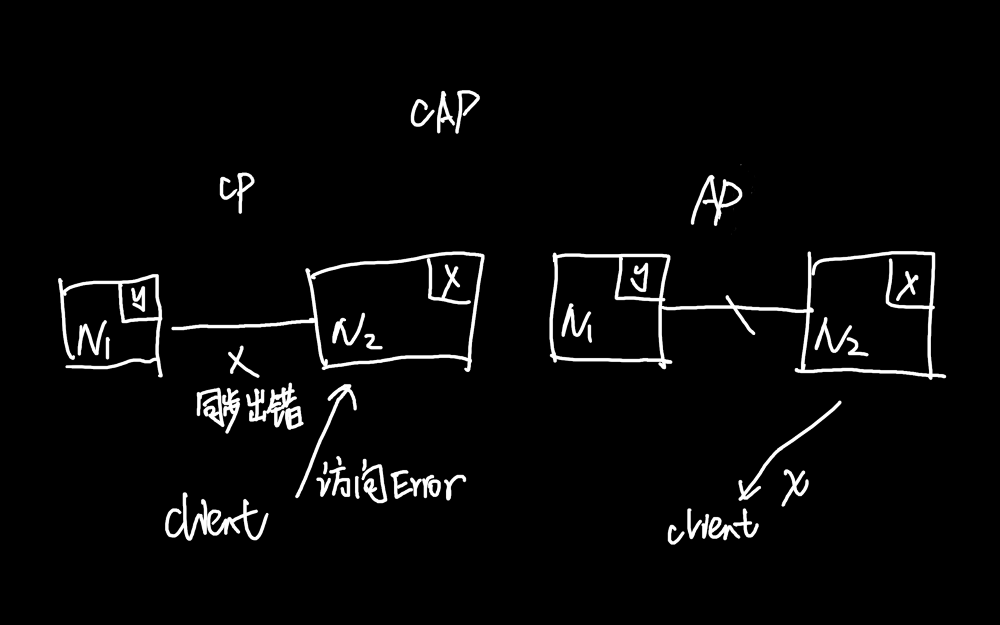

《从0开始学架构》- 李运华 读书笔记

### 负载均衡：

- DNS(地理级别)
- 硬件(集群级别)
- 软件(机器级别)

### CAP 理论：

在一个分布式系统（指相互连接并共享数据的节点的集合）中，当涉及读写操作时，
只能保证一致性(Consistence)，可用性(Availability)，分区容错性(Partition Tolerance)三者中两个，另外一个必须牺牲。

- 一致性(C): 对某个指定的客户端来说，读操作保证能够返回最新的写操作结果
- 可用性(A)：非故障的节点在合理的时间内返回合理的响应（不是错误和超时的响应）
- 分区容忍性(P)：当出现网络分区后，系统能够继续『履行职责』（丢包、连接中断、拥塞等导致网络分区）

必须选择 P 因为网络无法100%可靠。如果我们选择了 CA 放弃了 P，发生分区现象时，为了保证 C
就得禁止写入，有写入请求时候系统返回 Error，这又和 A 冲突了。
所以分布式系统理论上只能用(保证 CA 发生 P 的时候矛盾)，只能选择AP/AP。

- CP: 当发生分区后， N1节点已经更新数据到 y，但是 N1和 N2 复制通道中断了，N2还是 x。
  这时client 访问 N2时，N2需要返回 Error，提示客户端系统发生了错误。违背了可用性要求
- AP: 还是上一种场景但是 N2 直接返回了老的数据 x，虽然不正确确是一个合理的结果，违背了 C。

### CAP 细节：

- 关注的粒度是数据，不是整个系统。需要根据不同应用场景和要求来设计，每类数据用不同策略。
- CAP是忽略网络延迟的。布鲁尔定义一致性没考虑复制延迟，而现实中复制总是需要花费时间的。
  C不可能完美实现，总会有延迟，数据复制过程中不一致，
- 正常运行情况下，不存在CP和 AP 的选择，可以同时 CA。分区没发生的时候可以考虑 CA。
- 放弃不等于什么都不做，需要未分区恢复后做准备，牺牲只是说分区过程中无法保证 C or
  A。可以在分区之间进行一些操作，从而让分区故障解决后，系统重新达到 CA 的状态。

### ACID

ACID 是为了保证数据库事务的正确性提出来的一个理论。

- Atomicity（原子性）

一个事务中的所有操作，要么全部完成，要么全部不完成，不会在中间某个环节结束。事务在执行过程中发生错误，会被回滚到事务开始前的状态，就像这个事务从来没有执行过一样。

- Consistency（一致性）

在事务开始之前和事务结束以后，数据库的完整性没有被破坏。

- Isolation（隔离性）

数据库允许多个并发事务同时对数据进行读写和修改的能力。隔离性可以防止多个事务并发执行时由于交叉执行而导致数据的不一致。事务隔离分为不同级别，包括读未提交（Read uncommitted）、读提交（read committed）、可重复读（repeatable read）和串行化（Serializable）。

- Durability（持久性）

事务处理结束后，对数据的修改就是永久的，即便系统故障也不会丢失。

### BASE

- BA(Baciscally Available): 基本可用。分布式系统发生故障，允许损失部分可用性，保证核心可用
- S(Soft State): 软状态。允许中间状态，该中间状态不会影响系统整体可用性。（这里的中间状态就是 CAP 中数据不一致）
- E(Eventual Consistency): 最终一致性。系统中的所有数据副本一定时间后，最终能够达到一致的状态。

核心思想是如果无法做到强一致性(CAP中的一致性就是强一致性)，应用适当的方式达到最终一致性，对 AP 的一种补充。

- CAP 是忽略延时的，实际场景无法避免(完美的 CP 不存在)
- AP 牺牲一致性只是指分区期间，而不是永远放弃一致性

ACID 是数据库事务完整性的理论，CAP 是分布式设计理论，BASE 是 CAP 中 AP 方案的延伸。

### FMEA，排除架构可用性隐患

FMEA(Failure mode and effects analysis, 故障模式与影响分析)

- 给出初始的架构设计图
- 假设架构中某个部件故障
- 分析故障对系统功能的影响
- 分居分析结构判断是否需要优化

FMEA 分析表：

- 功能点。从用户角度看
- 故障模式。故障点和故障形式，尽量精确描述
- 故障影响。功能点受到的具体影响
- 严重程度。业务角度，致命/高/中/低/无
- 故障原因。
- 故障概率。高中低。硬件、开源系统、自研系统
- 风险程度，综合严重程度和故障概率判断最终等级。风险程度=严重程度x故障概率
- 已有措施。报警、 容错、自恢复
- 规避措施。技术手段和管理手段
- 解决措施：技术手段
- 后续计划：哪些还缺少应对措施，根据优先级排序提出后续解决计划

# 双机架构

### 主备复制

备机只起到备份作用，不承担实际读写操作。需要人工干预把备机改为主机。后台管理系统用得多

### 主从复制

主写从读。可能出现数据不一致问题，故障要人工干预。适合写少读多，论坛、BBS、新闻网站等

### 双机切换
主备切换和主从切换

常见架构：

- 互连式：主备机直接建立状态传递的渠道
- 中介式：主备机都去连接中介，通过中介传递状态信息。mongodb 的 Replica set。成熟的中介式方案：ZooKeeper/Keepalived
- 模拟式：备机模拟成客户端，向主机发起模拟的读写操作，根据读写操作的响应情况判断主机状态。

### 主主复制

需要保证数据能双向复制，但是很多无法做到，用户 id，库存，余额等。一般是临时、可丢失可覆盖的数据场景

# 集群和分区

### 数据集群
- 数据集中集群。ZooKeeper ZAB算法
- 数据分散集群。均衡性、容错性、可伸缩性。Hadoop Namenode。Elasticsearch
  集群通过选举一台服务器来做数据分区的分配，masternode

### 数据分区

按照一定规则分区，不同分区放在不同地理位置。考虑因素

- 数据量
- 分区规则
- 复制规则，集中式、互备式、独立式

# 如何设计计算高可用架构

- 哪些服务器可以执行
- 任务如何重新执行

常用模式：

- 主备：适合内部、后台使用人数不多，频率不高的业务，不太适合在线业务
- 主从：从机也执行部分任务。任务分配器会复杂一些
- 集群：
    - 对称集群(负载均衡集群)，任务分配器需要选取分配策略，检查服务器状态。
    - 非对称集群。一部分任务给 master，一部分 slave。任务分配和角色分配更复杂（ZAB,Raft leader 选举）

# 业务高可用：异地多活架构

处理地域级别灾难。异地指的是地理位置不同地方，多活值得是每个位置都能提供服务（活跃）
复杂度和成本会上升。特定业务需要异地多活

架构模式

- 同城异区。同一个城市不同区。无法应对极端场景
- 跨城异地。不同城市的多个机房。复杂度大幅上升。不可控因素增多（网线挖断等），时延。
  强一致性无法做到跨城异地多活（存款余额，支付宝余额等）这种只能用同城异区。
  对数据一致性要求没那么高，或者数据不经常变动，或者丢失也没太大影响的可以用。
- 跨国异地。场景：
  - 为不同地区用户提供服务
  - 只读类业务。比如搜索引擎

# 如何有效地学习开源项目

自顶向下的学习技巧。

- 安装。学习系统依赖组件，目录结构，系统工具。带着问题学习
- 运行。命令行和配置文件
- 原理研究。系统性。通读设计文档；阅读网上已有的分析文档；Demo验证
  - 关键特性的基本实现原理
  - 优缺点对比分析
- 测试。先研究原理后测试
- 源码研究。不建议通读所有代码。写demo测试调用基础库完成一些简单的功能，通过调用栈理解处理逻辑

# 异地多活四大技巧

- 保证核心业务的异地多活
- 保证核心数据最终一致性
- 采用多种手段同步数据。消息队列、二次读取、存储系统同步方式、回源读取方式、重新生成数据方式
- 只保证绝大部分用户的异地多活。补偿措施：挂公告；事后补偿；补充体验

核心思想是才用多种手段保证大部分用户的核心业务异地多活

# 异地多活设计4步走

### 1业务分级

访问量、核心业务、产生大量收入的业务

### 2数据分类

维度：数据量、唯一性、实时性、可丢失性(session)、可恢复性

### 3数据同步

- 存储系统同步
- 消息队列同步(Kafka\ActiveMQ\RocketMQ)。适合无事务性或者无时序性
- 重复生成可以重复生成的数据（session\cookie\缓存）

### 4异常处理

目的：

- 发生问题，避免少量数据异常导致整体业务不可用
- 问题恢复后，将异常的数据进行修正
- 对用户安抚、模拟损失

常见的异常处理措施：

- 多通道。mysql主从和消息队列。多通道不要用相同的网络连接；需要数据是可覆盖的（帐号可以，密码就不行）
- 同步和访问(异地机房通过系统的接口来进行数据访问)结合。
- 日志记录，用于故障恢复。
- 用户补偿。代金券、礼包、礼品、红包等

# 如何应对接口级别故障

- 内部原因: 程序bug导致死循环，某个接口导致慢查询，程序逻辑不完善导致耗尽内存等
- 外部原因: 黑客攻击、促销或抢购，三方系统大量请求，响应慢等

### 降级

功能降低或者完全停掉所有功能。（丢车保帅，优先保证核心业务）

- 系统后门降级。
- 独立降级系统

### 熔断

降级目的是应对自身系统故障，熔断目的是应对依赖的外部系统的故障。
需要统一的 API 调用层。阈值的设计可以根据实际观察来确定。

### 限流

从用户访问压力的角度，丢弃超出系统访问能力的请求。

- 基于请求限流：限制总量、限制时间量。方式是限制某个指标的上限。根据阈值限制适合比较简单的系统(负载均衡、网关、抢购系统)
- 基于资源限流。基于系统使用资源的上限限制。连接数、文件句柄、线程数、请求队列等。先推断、后优化

### 排队

排队模块、调度模块、服务模块

# 可扩展架构的基本思想和模式

### 可扩展的基本思想（拆）

常见的拆分思路：

- 面向流程拆分：拆分业务流程为几个阶段，每个阶段作为一部分
- 面相服务拆分
- 面向功能拆分

拆分方式决定了扩展方式

### 可扩展方式

面向流程：扩展时大部分情况只需要修改某一层或关联的两层。
面向服务：增加新服务只需要扩展相关服务
面向功能：增加新的功能模块

面向流程拆分：分层架构
面向服务拆分：SOA、微服务
面向功能拆分：微内核架构

# 传统的可扩展架构模式：分层架构和 SOA

### 分层架构

常见 3 层(MVC)

- C/S, B/S
- MVC, MVP：划分对象是单个业务子系统，划分维度是职责
- 逻辑分层架构：划分维度也是职责。自顶向下依赖

无论何种分层维度，核心是保证各层之间差异足够清晰，边界足够明显，让人看到架构图之后就能看懂整个架构
隔离关注点，只关心本层逻辑。保证层与层之间依赖是稳定的，才能支撑快速扩展

### SOA

SOA(Service Oriented Architecture)，面向服务的架构。三个关键概念：

- 服务。所有业务功能都是一项服务。粒度划分需要根据企业实际情况判断
- ESB(Enterprise Service Bus，企业服务总线)。屏蔽异构系统对外提供各种不同的接口方式，达到服务间高效的互联沟通。
- 松耦合。独立运行

# 深入理解微服务架构：银弹or焦油坑

### 微服务与 SOA 关系

small, lightweight, automated

### 微服务的陷阱

- 划分服务过细，服务间关系复杂。单个复杂度下降，系统复杂度上升，将系统内复杂度上升到了系统间
- 服务数量多，团队效率急剧下降。
- 多个接口、多个工程
- 多个环境
- 运维工程师每次都要操作多个微服务
- 调用链太长，性能下降，定位问题变难

# 微服务架构最佳实践 - 方法篇

### 服务粒度
基于团队规模。三个火枪手（一个微服务三个人负责开发）

### 拆分方法

- 基于业务逻辑。确定合适的职责范围。
- 基于可扩展拆分。按照稳定性排序，拆分为稳定服务和变动服务
- 基于可靠性。可靠性要求高的和低的
- 基于性能。压力大的模块拆出来

### 基础设施

- 服务发现、服务路由、容错
- 接口框架、API网关：提升开发对接效率
- 自动化部署、服务跟踪、配置中心：测试和运维效率
- 服务监控、跟踪、服务安全：运维效率

# 微服务架构最佳实践：基础设施篇

### 自动化测试

单测、系统级集成测试、系统间接口测试

### 自动化部署

版本管理、资源管理、部署和回退操作

### 配置中心

配置版本管理、增删改查、节点管理、配置同步、配置推送

### 接口框架

统一形式（接口协议和数据格式），提供统一的不同语言的包

### API网关

外部系统访问接口都需要通过 API 网关。主要包括接入鉴权、权限控制、传输加密、请求路由、流量控制等
### 服务发现

自理式: 每个微服务自己完成服务发现。实现简单，可以通过统一程序包提供给各个微服务

代理式：微服务之间有个负载均衡系统完成服务发现。可用性和性能风险

核心功能就是服务注册表，记录所有服务节点的配置和状态。每个微服务启动后都要将自己的信息注册到服务注册表，
然后由微服务或者 locad balancer 系统到服务注册表查询可用服务。

### 服务路由

一般和服务发现一起，挑选一个具体节点发起请求。常见算法：随机路由、轮询路由、 最小压力路由、最小连接数路由等

### 服务容错

节点数增加导致某个微服务故障概率增加。
请求重试、流控和服务隔离，通常服务容错会集成在服务发现和服务路由系统中

### 服务监控

- 实时搜集信息并进行分析
- 实时分析基础上进行预警

建议独立系统

### 服务跟踪

目前绝大部分实现都是基于 google dapper 论文
《Dapper, A Large-Scale Distributed Systems Tracing Infrastructure》

### 服务安全

接入安全、数据安全、传输安全

# 微内核架构

Microkernel Architecture，也被称为插件化架构(Plug-in Architecture)

### 基本架构

- 核心系统：负责和具体业务功能无关的通用功能，如模块加载、模块间通信等
- 插件模块：负责实现具体业务逻辑

### 设计关键点

- 插件管理,插件注册表机制
- 插件连接，连接规范。OSGI(Eclipse)、消息模式、依赖注入(Spring)
- 插件通信

### OSGI

open services gateway initiative

### 规则引擎
可扩展、易理解、高效率

# 架构师如何判断技术演进的方向

- 潮流派
- 保守派。拿一把锤子解决所有问题
- 跟风派。跟着竞争对手步子走

从企业业务发展考虑（铁三角：市场、技术、管理）

# 互联网技术演进模式
初创、发展、竞争、成熟期

复杂性和用户规模

# 互联网架构模板：存储层技术

### SQL

中间件(DBProxy)
平台：淘宝 UMP(unified mysql platform)

### NoSQL

存储平台

- 资源动态按需分配
- 资源自动化管理
- 故障自动化处理

### 小文件存储

比如图片，商品描述。 数据小、量大、访问量巨大

Hbase, Hadoop, Hypertable, FastDFS
淘宝 TFS，京东 JFS, Facebook Haystack

### 大文件存储

业务大数据：视频、电影

海量日志：访问日志、操作日志、用户轨迹日志

Bigtable
Hadoop 系列（HDFS, HBase）

淘宝云梯，腾讯 TDW

# 互联网架构模板：开发层和服务层技术

### 开发层

统一的开发框架；web服务器；容器技术

### 服务层

降低系统间相互关联复杂度

- 配置中心 通过系统标识+host+port
- 服务中心
  - 服务名字系统
  - 服务总线系统
- 消息队列。RocketMQ, Kafka, ActiveMQ

# 互联网架构模板：网络层技术

### 负载均衡

- DNS。地理级别负载。通用成本低，混存时间长，不灵活
- Nginx, LVS, F5。机器级别。 Nginx是7层，LVS是内核4层，F5是硬件的4层负载均衡。阿里SLB

### CDN

内容缓存在离用户最近的地方

### 多机房

同城多机房、跨城多机房、跨国多机房

### 多中心

多机房为了容灾，多中心同时对外提供服务。关键在于数据一致性和数据事务性如何保证。

# 互联网架构模板：用户层和业务层技术

### 用户层技术

- 用户管理
  - 单点登录(SSO), cookie, JSONP, token，最成熟的 CAS
  - 授权登录, OAuth2.0
- 消息推送
  - 途径：短信、邮件、站内信、app推送
  - APP: iOS APNS。Android 五花八门
  - 自研推送：设备管理（唯一标识、注册、注销）、连接管理和消息管理
- 存储云、图片云

### 业务层技术

拆，合(强相关)

# 互联网架构模板：平台技术

### 运维平台
配置、部署、监控、应急

- 标准化
- 平台化
- 自动化
- 可视化

### 测试平台

- 用例管理
- 资源管理
- 任务管理
- 数据管理

### 数据平台

数据管理、分析、应用

- 数据管理。采集、存储、访问、安全
- 数据分析。统计、挖掘、机器学习、深度学习
- 数据应用。在线和离线

### 管理平台
权限管理

- 身份认证
- 权限控制

# 架构重构内功心法第一式：有的放矢

- 业务不能停
- 关联方众多，牵一发而动全身
- 旧架构约束

从一大堆问题中识别真正需要重构来解决的问题，集中力量快速解决，而不是想着通过重构架构解决所有问题
