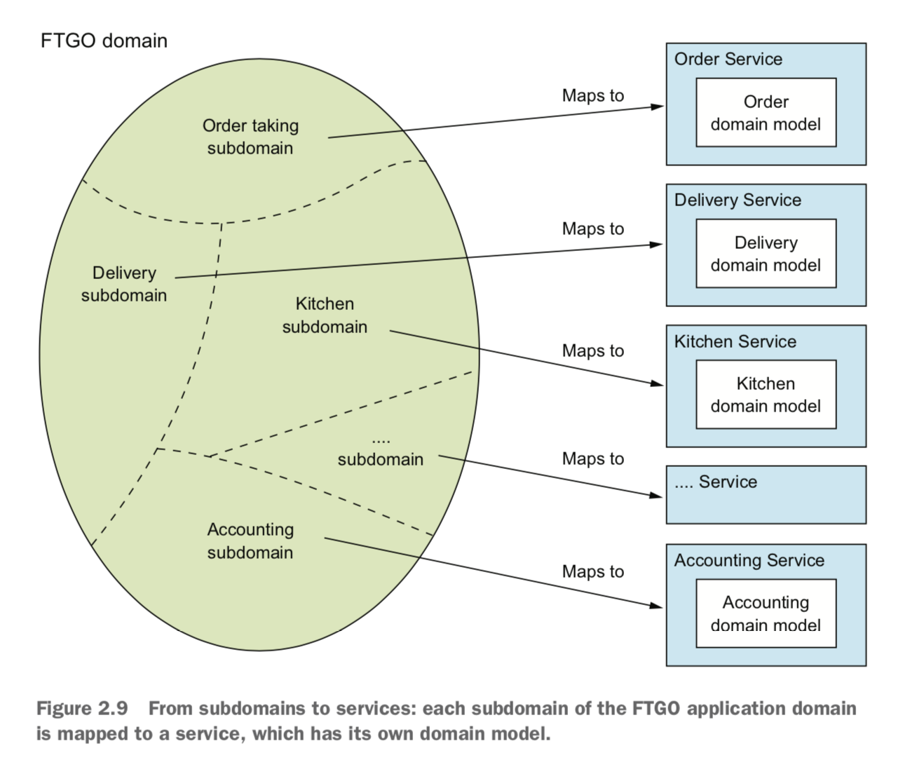

# 1. 逃离单体地狱

> 没有银弹。

微服务：把应用程序功能性分解为一组服务的架构风格。每个服务是一组专注的、内聚的功能职责组成。
每个服务是松耦合的，有自己的私有数据库，通过 API 通信。每个服务可以独立开发，部署，测试和扩展。

好处：

- 持续交付和部署
- 容易维护
- 独立部署，扩展
- 团队自治
- 实现和采纳新技术
- 更好的容错性

缺点：

- 服务拆分和定义是一项挑战（糟糕的是搞成了分布式单体应用）
- 分布式系统带来的各种复杂性，使开发、部署和测试变得更困难
- 跨服务开发需要协调多个团队。服务部署可能要按照依赖关系排序
- 什么阶段使用微服务？初创公司几乎都是从单体应用开始

模式：模式是针对特定上下文中发生的问题的可重用解决方案。

常用的模式结构包括；

- 需求:必须解决的问题和围绕这个问题的特定上下文环境。优先级排序
- 结果上下文。好处，弊端，问题。
- 相关模式：前导；后续，替代；泛化；特化

服务拆分相关模式：

- 根据业务能力分解，围绕业务功能组织服务
- 根据子域分解，子域围绕领域驱动设计(DDD)来组织服务

通信相关模式：

- 服务风格：哪一种 IPC
- 服务发现
- 可靠性
- 事务性消息：事件动作和数据库事务集成
- 外部 API

实现事务管理的数据一致性相关模式：Saga 模式

查询数据：CQRS（命令查询职责隔离）

部署模式：通过命令行或者界面部署和管理服务。部署平台往往基于虚拟机，容器

可观测性：

- 健康检查 API
- 日志聚合: 集中式日志服务器来检索和触发报警
- 分布式追踪：为外部请求分配唯一 ID，用于各个服务之间追踪
- 异常跟踪：异常发送到跟踪服务
- 应用指标：指标服务器
- 审计日志：记录用户行为

自动化测试相关模式：

- 消费端驱动的契约测试
- 消费端契约测试
- 服务组件测试

基础设置和边界问题：可观测性模式和服务发现模式

安全相关模式：API Gateway。 （访问令牌模式）

# 2. 服务的拆分策略

软件架构4+1(场景)视图模型：

- 逻辑视图
- 实现视图
- 进程视图
- 部署视图

什么是服务：单一的可独立部署的软件组件， 它实现了一些有用的功能。实现应用程序模块化，松耦合。

微服务的大小『不是』重要考虑因素。如果你的服务出发其他服务同步更新，可能没有实现松耦合。

### 2.2 为应用程序定义微服务架构

##### 2.2.1 识别系统操作

- 定义系统操作。起点是用户需求，包含用户故事和相关用户场景。
  - 1. 创建由关键类组成的抽象领域模型，这些关键类提供了用于系统操作的词汇表
  - 2. 确定系统操作， 并根据领域模型描述每个系统操作的行为
    - 命令型：创建，更新或者删除数据。命令对应的参数，返回值和行为（行为包括前置条件和后置条件）
    - 查询型：查询和读取数据的系统操作

##### 2.2.2 根据业务能力进行服务拆分

业务能力：能为公司或组织产生价值的商业活动。

- 供应商管理
- 消费者管理
- 订单或者和执行
- 会计记账
- 其他

##### 2.2.3 根据子域进行服务拆分

领域驱动设计

领域的边界称为限界上下文(bounded context)

##### 2.2.4 拆分的指导原则

单一职责: 改变类应该只有一个理由

闭包原则: 包中包含的所有类应该是对同类变化的一个集合。

##### 2.2.5 拆分单体为微服务的难点

- 网络延迟。批处理
- 同步进程间通信导致可用性降低
- 服务之间维持数据一致性。Saga
- 获取一致的数据视图
- 上帝类。整个应用程序中使用到的全局类

##### 2.2.6 定义服务 API

- 把系统操作分配给服务
- 确定支持服务协作所需要的 API

# 3. 微服务架构中的进程间通信

### 3.1 进程间通信

交互方式两个纬度：

- 一对一
- 一对多

- 同步
- 异步

API 演化:

- 语义化版本控制。MAJOR.MINOR.PATCH

消息格式：

- 文本。json/xml，易于修改
- 二进制

### 3.2 基于同步远程过程调用模式的通信

- REST

rest 没有 IDL，但是有 Open API 规范。
grpc 不太好处理获取多个资源的情况

- gRPC

使用二进制格式的 Protocol Buffers

- 使用断路器模式处理局部故障：断路器在连续失败次数超过指定阈值的一段时间内，这个代理会立即拒绝其他调用。

开发可靠的远程过程调用代理：

- 网络超时
- 限制客户端向服务器发出请求的数量
- 断路器模式：失败超过一定阈值就启动断路器，让后续调用立刻失败。之后客户端继续尝试，如果调用成功，则解除断路器.

Netflix Hystrix shi 一个实现这些和其它模式的开源库。

从服务失效故障中恢复

- 返回错误
- 返回默认值或者缓存响应

##### 3.2.4 使用服务发现

两种模式

- 服务及其客户直接与服务注册表交互
- 通过部署基础设置来处理服务发现(更推荐)

### 3.3 基于异步消息模式的通信

- 点对点
- 发布订阅

- 无代理架构: ZeroMQ

- 基于代理的消息

Apache ActiveMQ/RabbitMQ/Apache Kafka，还有基于云的消息服务 AWS Kinesis, SQS 等。

##### 3.3.5 处理并发和消息顺序

通常使用分片键让消息落到同一个分片，而且该分片中的消息始终由同一个接收方实例读取，保证按顺序处理这些消息。

##### 3.3.6 处理重置消息
大部分消息代理保证至少一次

- 编写幂等消息处理程序。
- 跟踪消息并处理重复项。比如在数据库中记录message id 来去重。

##### 3.3.7 事务性消息

数据库更新和消息发送都必须在事务中进行。

- 使用数据表作为消息队列（事务性发件箱）
- 通过轮询模式发布事件
- 使用事务日志拖尾(tailing)模式发布事件
  - Debezium
  - LinkedIn Databus
  - DynamoDB streams
  - Eventuate Tram

### 3.4 使用异步消息提高可用性

同步消息会降低可用性。（要求依赖的所有同步服务都可用）
