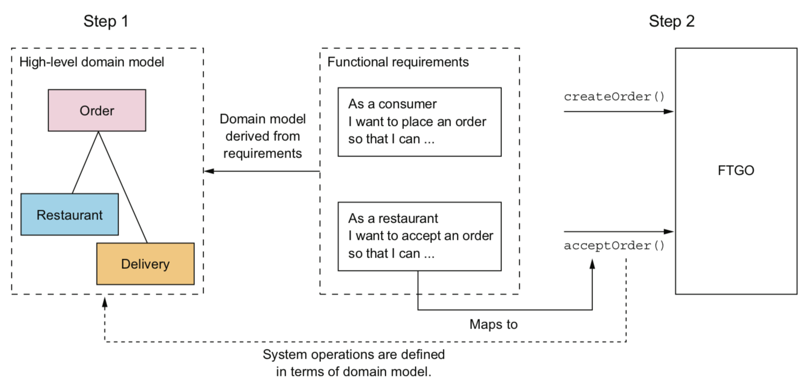

# 1. 逃离单体地狱

> 没有银弹。

微服务：把应用程序功能性分解为一组服务的架构风格。每个服务是一组专注的、内聚的功能职责组成。
每个服务是松耦合的，有自己的私有数据库，通过 API 通信。每个服务可以独立开发，部署，测试和扩展。

好处：

- 持续交付和部署
- 容易维护
- 独立部署，扩展
- 团队自治
- 实现和采纳新技术
- 更好的容错性

缺点：

- 服务拆分和定义是一项挑战（糟糕的是搞成了分布式单体应用）
- 分布式系统带来的各种复杂性，使开发、部署和测试变得更困难
- 跨服务开发需要协调多个团队。服务部署可能要按照依赖关系排序
- 什么阶段使用微服务？初创公司几乎都是从单体应用开始

模式：模式是针对特定上下文中发生的问题的可重用解决方案。

常用的模式结构包括；

- 需求:必须解决的问题和围绕这个问题的特定上下文环境。优先级排序
- 结果上下文。好处，弊端，问题。
- 相关模式：前导；后续，替代；泛化；特化

服务拆分相关模式：

- 根据业务能力分解，围绕业务功能组织服务
- 根据子域分解，子域围绕领域驱动设计(DDD)来组织服务

通信相关模式：

- 服务风格：哪一种 IPC
- 服务发现
- 可靠性
- 事务性消息：事件动作和数据库事务集成
- 外部 API

实现事务管理的数据一致性相关模式：Saga 模式

查询数据：CQRS（命令查询职责隔离）

部署模式：通过命令行或者界面部署和管理服务。部署平台往往基于虚拟机，容器

可观测性：

- 健康检查 API
- 日志聚合: 集中式日志服务器来检索和触发报警
- 分布式追踪：为外部请求分配唯一 ID，用于各个服务之间追踪
- 异常跟踪：异常发送到跟踪服务
- 应用指标：指标服务器
- 审计日志：记录用户行为

自动化测试相关模式：

- 消费端驱动的契约测试
- 消费端契约测试
- 服务组件测试

基础设置和边界问题：可观测性模式和服务发现模式

安全相关模式：API Gateway。 （访问令牌模式）

# 2. 服务的拆分策略

软件架构4+1(场景)视图模型：

- 逻辑视图
- 实现视图
- 进程视图
- 部署视图

什么是服务：单一的可独立部署的软件组件， 它实现了一些有用的功能。实现应用程序模块化，松耦合。

微服务的大小『不是』重要考虑因素。如果你的服务出发其他服务同步更新，可能没有实现松耦合。

### 2.2 为应用程序定义微服务架构

##### 2.2.1 识别系统操作

- 定义系统操作。起点是用户需求，包含用户故事和相关用户场景。
  - 1. 创建由关键类组成的抽象领域模型，这些关键类提供了用于系统操作的词汇表
  - 2. 确定系统操作， 并根据领域模型描述每个系统操作的行为
    - 命令型：创建，更新或者删除数据。命令对应的参数，返回值和行为（行为包括前置条件和后置条件）
    - 查询型：查询和读取数据的系统操作

##### 2.2.2 根据业务能力进行服务拆分

业务能力：能为公司或组织产生价值的商业活动。

- 供应商管理
- 消费者管理
- 订单或者和执行
- 会计记账
- 其他

##### 2.2.3 根据子域进行服务拆分

领域驱动设计

领域的边界称为限界上下文(bounded context)

